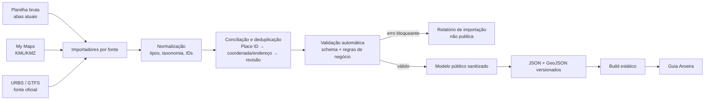
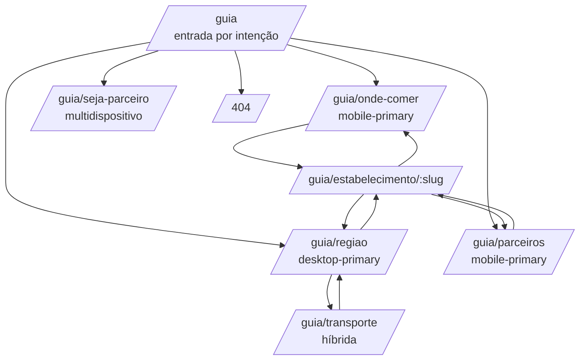
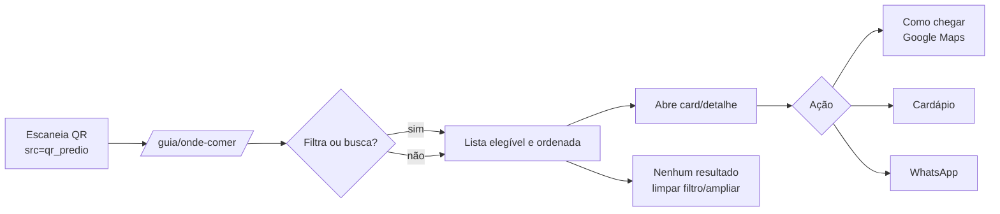
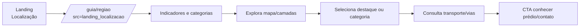

# Planejamento do Guia Aroeira Office Park

**Fase:** 1 — auditoria, arquitetura e planejamento  
**Data da auditoria:** 17/07/2026  
**Estado:** aguardando aprovação explícita para implementação  
**Escopo desta fase:** somente leitura do workspace, da planilha, do My Maps e do protótipo. Nenhum código de produção, célula, marcador, camada, credencial ou deploy foi alterado.

## 0. Como ler este documento

Para não misturar evidência com decisão, o documento usa três rótulos:

- **Fato observado:** verificado diretamente no workspace, na planilha, na exportação KMZ/KML do My Maps ou no HTML publicado do protótipo.
- **Inferência:** conclusão provável a partir dos fatos, ainda sujeita a confirmação de negócio.
- **Recomendação:** decisão de produto ou arquitetura proposta para a implementação.

As contagens representam o estado observado em 17/07/2026. A auditoria da planilha foi feita pelos conectores do Google Drive/Sheets com intervalos delimitados e em modo somente leitura. O My Maps foi auditado por exportação pública KMZ, também sem qualquer escrita. O navegador visual integrado não estava disponível; por isso, a análise do protótipo se baseia no HTML renderizado público e nos seus artefatos declarados. Isso é suficiente para confirmar conteúdo, estrutura, tecnologia aparente e comportamento responsivo codificado, mas não substitui uma futura rodada de QA visual em viewports reais.

## 1. Resumo executivo e decisões recomendadas

O Guia Aroeira deve ser um único produto e uma única base pública, mas com composições realmente distintas por intenção e dispositivo. O fluxo de almoço nasce como ferramenta móvel de decisão; a região nasce como argumento comercial orientado a mapa no desktop; parceiros nasce como catálogo móvel; e seja-parceiro nasce como conteúdo comercial e captação multidispositivo.

Decisões centrais recomendadas:

1. **Uma aplicação Next.js com TypeScript**, mantendo a direção tecnológica observada no protótipo, mas criada em um repositório-fonte real. O workspace atual está vazio e o código do protótipo não está disponível localmente.
2. **Geração estática das páginas e dos estabelecimentos**, com pequenos componentes interativos apenas para busca, filtros, ordenação e mapa. Isso favorece Netlify, SEO e redes móveis.
3. **Planilha como fonte editorial canônica após normalização**, nunca consultada pelo navegador. No estado atual, `ESTABELECIMENTOS - YURI` é apenas a melhor semente estruturada; as abas de alimentação são fontes auxiliares brutas e My Maps é a fonte geográfica provisória.
4. **Pipeline híbrido e determinístico:** exportação/ingestão controlada → normalização → validação → JSON público versionado → build estático. No MVP, a atualização pode ser disparada manualmente, sem credenciais no site. Se a frequência crescer, o mesmo adaptador passa a ler a API do Google Sheets durante CI/build com credencial somente de servidor.
5. **Migrar coordenadas para a fonte canônica** depois da conciliação inicial. O My Maps não deve continuar como uma segunda base operacional que precise ser editada em paralelo.
6. **Leaflet + GeoJSON + provedor de tiles substituível** no MVP. Leaflet atende bem ao pequeno volume e permite sincronizar lista, filtros e marcadores. Não se deve depender indefinidamente dos servidores gratuitos de tiles padrão do OpenStreetMap; a política oficial exige uso responsável e permite bloqueio. O provedor deve ser configurável por ambiente.
7. **`/guia/transporte` deve existir como página própria**, com um resumo também presente em `/guia/regiao`. A rota própria é compartilhável e serve funcionários; a seção em região serve o argumento comercial. A publicação deve ser condicionada à coleta e validação de pontos/linhas, hoje inexistentes nas fontes.
8. **Netlify Forms é a opção inicial para os formulários** se o deploy permanecer no Netlify: baixo esforço, detecção no HTML estático, notificações e proteção por honeypot/Akismet. Formspree é a alternativa se a hospedagem mudar. Google Forms perde continuidade visual; Apps Script e banco próprio adicionam operação sem benefício proporcional neste estágio.
9. **Analytics sem identificação individual**, preferencialmente Plausible se houver orçamento. A alternativa de custo zero é adiar eventos avançados e usar métricas agregadas do provedor de hospedagem; não se recomenda introduzir GA4 por padrão antes de uma decisão de privacidade.
10. **Nenhum dado “desconhecido” vira “não”.** Ticket, VR, horário, acessibilidade, estacionamento e benefício só aparecem como confirmados quando houver fonte e data de verificação.

## 2. Auditoria do projeto/repositório atual

### 2.1 Workspace

**Fatos observados**

- O diretório `C:\Users\alleg\Desktop\pastas\codes\mapeamento-def1` está vazio.
- Não existe repositório Git nesse diretório.
- Não há `package.json`, código-fonte, configuração de deploy, testes, ativos, documentação ou arquivos de dados locais.
- Portanto, não existe stack local a preservar nem alterações pendentes de usuário com as quais conciliar.

**Impacto**

- A Fase 1 pode registrar este documento, mas a implementação precisa começar por receber o repositório-fonte do protótipo ou por criar um novo repositório no workspace.
- Não é possível afirmar a versão exata de Next.js, Tailwind ou dependências do protótipo apenas pelo HTML publicado.
- Estimativas incluem fundação técnica, CI e testes, não apenas evolução de um app existente.

### 2.2 Stack aparente do protótipo publicado

**Fatos observados**

- O HTML contém marcas de Next.js/React Server Components, chunks `/_next/static/...` e otimização `/_next/image`.
- A composição usa classes utilitárias responsivas e tokens semânticos como `forest`, `moss`, `brass`, `sand`, `fog` e `graphite`, consistentes com Tailwind ou solução equivalente.
- A página atual tem uma única entrada pública e o 404 padrão do framework.

**Recomendação**

- Usar Next.js App Router + TypeScript + Tailwind CSS, desde que o código-fonte original não revele outra base adequada.
- Evitar SSR por requisição no MVP: usar geração estática (`generateStaticParams` para slugs) e componentes cliente pequenos.
- Proposta inicial de módulos:

```text
src/
  app/guia/
    page.tsx
    onde-comer/page.tsx
    regiao/page.tsx
    parceiros/page.tsx
    transporte/page.tsx
    seja-parceiro/page.tsx
    estabelecimento/[slug]/page.tsx
  components/
    domain/          # cartões, benefício, verificação, transporte
    layout/          # shells e navegações por fluxo/dispositivo
    ui/              # botões, chips, dialogs, estados
    map/             # integração Leaflet e sincronização
  data/
    adapters/        # planilha, KML, JSON
    generated/       # projeção pública gerada
    schemas/         # schemas e validações
  domain/
    establishments/  # regras de status, filtros, ordenação
    partnerships/
    transit/
  lib/analytics/
scripts/
  import-data/
tests/
```

## 3. Auditoria da planilha `MAPEAMENTO`

Planilha: [MAPEAMENTO](https://docs.google.com/spreadsheets/d/1xUPFkc8rYy2ZlKY7wZeayvmBcWiw0Z6H_2Ep0-tmgfU/edit)

### 3.1 Metadados e abas

| Aba | `sheetId` | Estado observado | Registros úteis aproximados |
|---|---:|---|---:|
| ESTABELECIMENTOS - IAN | 0 | somente cabeçalho | 0 |
| ESTABELECIMENTOS - MAIA | 62444381 | somente cabeçalho | 0 |
| ESTABELECIMENTOS - YURI | 450394479 | tabela estruturada; primeira linha congelada | 40 |
| ALIMENTAÇÃO - IAN | 258317482 | lista de dados sem cabeçalho | 17 linhas, 16 nomes únicos dentro da aba |
| ALIMENTAÇÃO MAIÃ | 1667649480 | lista de dados sem cabeçalho e linhas vazias intercaladas | 17 linhas úteis |
| PARCERIA | 1598512473 | vazia, sem cabeçalho | 0 |
| LINHAS | 1811695070 | somente cabeçalho | 0 |

### 3.2 Fonte estruturada atual: `ESTABELECIMENTOS - YURI`

**Cabeçalhos observados, na ordem real:** `NOME`, `NOTA`, `QTDE. REVIEWS`, `ENDEREÇO`, `city`, `state`, `countryCode`, `SITE`, `TEL.`, `CATEGORIA 6`, `URL`, `TIPO`, `CATEGORIA 1`, `CATEGORIA 2`, `CATEGORIA 3`, `CATEGORIA 4`, `CATEGORIA 5`.

| Campo | Preenchimento | Observação de qualidade |
|---|---:|---|
| nome | 40/40 | nenhum nome duplicado após normalização exata |
| nota | 37/40 | snapshot sem data de coleta |
| quantidade de reviews | 37/40 | snapshot sem data de coleta |
| endereço | 40/40 | texto livre; sem CEP separado |
| cidade | 40/40 | consistente como Curitiba |
| estado | 40/40 | inconsistente: `PR` e `Paraná` |
| país | 40/40 | `BR` |
| site | 32/40 | todos com esquema HTTP(S); 7 são Instagram, além de agregadores/links intermediários |
| telefone | 37/40 | texto livre; precisa normalização E.164 e definição de uso público |
| URL Google Maps | 40/40 | todas contêm `query_place_id`; 40 Place IDs únicos extraíveis |
| tipo/categorias | 40/40 no tipo e categoria 1 | 48 rótulos distintos; granularidade e capitalização não formam taxonomia de produto |
| latitude/longitude | 0/40 | ausentes |
| distância/tempo a pé | 0/40 | ausentes |
| horários | 0/40 | ausentes |
| última verificação | 0/40 | ausente |

**Fato importante:** a presença de 40 Place IDs únicos torna esta aba a melhor semente de identidade para estabelecimentos gerais. O Place ID deve ser extraído para uma coluna própria; não deve continuar escondido apenas dentro da URL.

### 3.3 Abas de alimentação

As duas abas não têm cabeçalho. A coluna A mistura nome e endereço em uma única string; B contém distância como texto (`80m`, `650m`, `1200m`); C contém faixa de preço como texto (`20-40`, `60 - 140`).

**Contagens consolidadas**

- 34 linhas úteis.
- 31 nomes únicos por heurística simples.
- Duplicidades exatas: `Dalle Pizza - Tarumã` aparece nas duas abas; `Habib's` aparece nas duas; `Leve Sabor` aparece duas vezes em `ALIMENTAÇÃO - IAN`.
- 11 das 34 linhas não têm preço.
- Quatro registros declaram distância acima de 1 km: McDonald's - Cristo Rei (1200 m), Subway - Tarumã (1100 m), Festval Jardim Social (1200 m) e Família Farinha (1100 m).
- Somente `Rio Verde` e `Super Muffato Tarumã` coincidem exatamente com a aba YURI e com o My Maps.
- Não há Place ID, coordenadas, telefone, horário, tipo de gastronomia, VR, serviço, cardápio, parceria ou data de verificação.

**Inferência:** as abas de alimentação são coleta exploratória, não tabelas prontas para consumo. O parser pode sugerir nome/endereço/preço, mas cada linha precisa de conciliação e revisão humana antes de publicação.

### 3.4 Abas de estabelecimentos IAN/MAIA

As duas estão sem dados, mas possuem o mesmo esquema de 24 colunas: `NOME`, `ENDERECO`, `TELEFONE`, `FOTO`, `SITE`, `DESCRICAO`, `CATEGORIA`, `HORARIO DE FUNCIONAMENTO`, `PRECO`, `TIPO`, `DELIVERY`, `RAMO`, `DISTANCIA`, `ACESSO POR QUAL AVENIDA PRINC`, `WHATSAPP`, `REDES SOCIAIS`, `EMAIL`, `ESTACIONAMENTO PROPRIO`, `ACESSIBILIDADE`, `LOGO`, `CATEGORIA PRINCIPAL`, `SUBCATEGORIA`, `PUBLICO-ALVO`, `OBS`.

Esse cabeçalho antecipa vários campos úteis, mas mistura dados públicos, classificação, marketing e operação em uma única linha. Como não há registros, ele não deve ser escolhido como fonte canônica só por ter mais colunas.

### 3.5 `PARCERIA`

**Fato observado:** aba completamente vazia, sem cabeçalho ou registros. Não há benefício real que possa ser publicado ou usado para validar o desenho atual.

**Impacto:** `/guia/parceiros`, badges de parceiro e o filtro “somente conveniados” precisam nascer com estado vazio e feature gating. Benefícios reais são uma dependência de conteúdo, não devem ser inventados.

### 3.6 `LINHAS`

**Cabeçalhos observados:** `NUMERO`, `SENTIDO`, `PONTO DE PARADA + PROX`, `DISTANCIA`, `TERMINAL ORIGEM`, `TERMINAL DESTINO`, `TIPO DE LINHA`, `HORARIO FUNCIONAMENTO`, `FREQUENCIA`, `FUNCIONA 24H`, `DIAS DE FUNCIONAMENTO`, `OBS`.

**Fato observado:** não há nenhuma linha de dados. Não existem IDs de ponto, coordenadas, fontes oficiais, URLs ou datas de verificação.

**Recomendação:** não preencher manualmente horários/frequências detalhados. O portal de Dados Abertos de Curitiba informa disponibilidade de GTFS, linhas, pontos, itinerários e tabelas via URBS; o guia deve armazenar apenas a seleção curada dos pontos/linhas relevantes e links oficiais, usando a fonte oficial para informação dinâmica: [Transporte Coletivo de Curitiba](https://dadosabertos.curitiba.pr.gov.br/conjuntodado/detalhe?chave=ca40f13b-ef61-472b-810f-dd705f85fd2e&locale=en) e [Horário de Ônibus — URBS](https://www.urbs.curitiba.pr.gov.br/portal/horario-de-onibus/).

### 3.7 Fonte canônica: conclusão

**Agora, antes de normalizar**

- Estabelecimentos gerais: `ESTABELECIMENTOS - YURI` é a semente estruturada principal.
- Alimentação: as duas abas de alimentação são fontes auxiliares de candidatos, com deduplicação e enriquecimento obrigatórios.
- Coordenadas: My Maps é a fonte provisória.
- Parcerias: não existe fonte preenchida.
- Transporte: não existe fonte preenchida.

**Após aprovação e normalização**

- Criar uma tabela canônica única de estabelecimentos e tabelas relacionadas de parceria/transporte na própria planilha ou em abas normalizadas.
- Importar as abas atuais como `source_record`, preservando rastreabilidade; não destruí-las.
- Depois da conciliação, a planilha canônica passa a conter coordenadas. O My Maps deixa de ser necessário para manutenção cotidiana e pode ser regenerado/exportado, nunca editado como segunda verdade.

## 4. Auditoria do My Maps `aop 1km`

My Maps: [aop 1km](https://www.google.com/maps/d/u/0/edit?mid=1eQQVOwJahLuWSvqpYqO8xweG7ecINro&usp=sharing)

### 4.1 Organização real

**Fatos observados na exportação KML**

- Documento: `aop 1km`.
- 2 folders/camadas: `Camada sem título` (vazia) e `circle.kml` (contém tudo).
- 66 placemarks: 1 linha do círculo, 1 ponto central, 1 marcador do Aroeira e 63 pontos de estabelecimentos.
- Coordenada do marcador `AROEIRA OFFICE PARK`: longitude `-49.2369476`, latitude `-25.428106`.
- O círculo foi gerado com raio nominal de 1 km e centro muito próximo, porém não idêntico, ao marcador do edifício (`-49.236795`, `-25.427813`).
- Todos os 63 pontos de estabelecimentos ficam a menos de 1 km em linha reta do marcador do Aroeira.
- Não há pontos de ônibus, linhas de ônibus ou rotas de transporte identificadas.
- Não há categorias por camada; todos os estabelecimentos usam o mesmo estilo de marcador.
- Não há descrições, endereços, Place IDs ou outras propriedades nos pontos — somente nome e coordenada.

### 4.2 Correspondência com a planilha

- 37 dos 40 nomes da aba YURI coincidem exatamente após normalização com pontos do My Maps.
- Presentes em YURI, mas sem correspondência exata no mapa: `Laundromat Lavanderia Self-Service`, `Auto Estofamento Cristo Rei` e `Escola Estadual Nossa Senhora de Fátima`.
- O mapa contém 26 nomes sem correspondência exata em YURI. Parte pode ser cadastro adicional válido; parte são subestabelecimentos no mesmo endereço; `Nossa Sra De Fatima` provavelmente corresponde semanticamente à escola citada acima, mas isso exige confirmação.
- Entre as listas de alimentação, somente `Rio Verde` e `Super Muffato Tarumã` têm correspondência exata no mapa.

### 4.3 Coordenadas compartilhadas

Há seis grupos de coordenadas idênticas:

1. Copacabana Sports / Escola Furacão Cocito & Rogério Souza.
2. Tok A Mais / Super Muffato Tarumã / Princess Dream Beauty Academy.
3. Federal Online / DLX Preparatório Militar.
4. Caixa Eletrônico Bradesco / Loterias Trevo do Tarumã.
5. Banco24Horas / Tecban.
6. G5AABB / Alan Vieira Judo School / Cris Cardoso cabeleireira unissex.

**Regra:** coordenada igual não significa automaticamente duplicidade; pode representar estabelecimentos distintos no mesmo imóvel. Esses grupos entram em fila de revisão. Marcadores coincidentes precisam de deslocamento visual (“spiderfy”) ou agrupamento no mapa.

### 4.4 Lacunas

- Sem categorias ou camadas de negócio.
- Sem Place ID para conciliação determinística.
- Sem transporte.
- Sem pontos dos restaurantes coletados nas abas de alimentação.
- Centro do círculo e marcador oficial não são idênticos.
- Nome do arquivo/camada não é semântico para o produto.
- KML apresenta nomes, mas não fornece metadados editoriais nem status de verificação.

## 5. Análise do protótipo existente

Protótipo: [Aroeira Office Park](https://aroeiramapeamento.netlify.app/)

### 5.1 Estrutura observada

1. Hero institucional com título, promessa de localização, CTA “Explorar entorno”, contadores “8 categorias” e “24 pontos mapeados”.
2. Imagem de mapa abstrato, não um mapa real.
3. Seção “Infraestrutura ao redor” com chips de oito categorias.
4. Grade de 24 cards, três por categoria, com categoria, nome, distância, descrição e link para busca no Google Maps.
5. Seção “Por que isso importa para o seu negócio?” com três argumentos comerciais.
6. Rodapé institucional.

### 5.2 Pontos aproveitáveis

- Identidade sóbria e apropriada: branco/neutros, verde escuro, verde secundário e dourado/bege discreto.
- Hierarquia semântica com `main`, `section`, `article`, títulos e links.
- Chips usam `aria-pressed`; controles têm foco visível declarado.
- A proposta comercial está clara e pode informar `/guia/regiao`.
- A malha responsiva demonstra uma base visual reutilizável.

### 5.3 Limitações

- Os 24 estabelecimentos são fictícios e estão embutidos na página; não podem migrar para a base real.
- O mapa é uma imagem decorativa e não sincroniza com lista/filtros.
- Existe uma única página; não atende os quatro fluxos nem as rotas definidas.
- A experiência móvel é uma grade responsiva da landing, não uma ferramenta de decisão rápida.
- Não há busca, ordenação, filtros de almoço, benefícios, detalhe, parceiros, transporte, formulários, estados de dados ou analytics de produto.
- Os links do Google Maps pesquisam por texto, não usam os Place IDs já presentes na planilha real.
- O 404 é o padrão técnico do framework e está em inglês.

**Recomendação:** reaproveitar somente os princípios de identidade e a argumentação comercial. A arquitetura de informação, os dados e as telas devem ser reconstruídos.

## 6. Inventário e autoridade das fontes

| Fonte | Conteúdo atual | Autoridade atual | Autoridade futura | Pode ir ao público? |
|---|---|---|---|---|
| YURI | identidade, contato, endereço, rating, Place ID implícito, categorias brutas | semente principal de estabelecimentos gerais | staging/legado após migração | apenas projeção sanitizada |
| Alimentação IAN/MAIA | candidatos, endereço concatenado, distância e preço parcial | fonte auxiliar | staging/legado | não diretamente |
| IAN/MAIA estabelecimentos | só esquema vazio | nenhuma | staging/legado | não |
| PARCERIA | vazia | nenhuma | canônica para parcerias, após modelagem | somente campos públicos |
| LINHAS | só esquema vazio | nenhuma | seleção curada, apoiada em URBS/GTFS | somente campos públicos e fonte |
| My Maps/KML | coordenadas, raio, nome | geografia provisória | importação/migração; não edição diária | GeoJSON público sanitizado |
| URBS/GTFS | linhas, pontos, itinerários e informação dinâmica | fonte oficial externa | fonte oficial de transporte | links/atribuição e dados permitidos |
| Protótipo | identidade e narrativa | referência visual | nenhuma autoridade de dados | não como dados |
| JSON gerado | projeção validada e sanitizada | artefato de deploy | fonte lida pelo site | sim |

Dados internos que nunca entram no JSON público: responsável interno do parceiro, e-mail/telefone interno, notas de negociação, autorização documental completa, histórico de moderação, dados pessoais de formulários e credenciais.

## 7. Arquitetura de dados e integração



### 7.1 Alternativas comparadas

| Alternativa | Manutenção | Credenciais | Confiabilidade | Custo | Veredito |
|---|---|---|---|---|---|
| Exportação manual para JSON | simples, mas sujeita a erro | não | alta se validada; risco de desatualização | zero | aceitável como bootstrap |
| Script de importação no build | baixa fricção após configurar | sim, se planilha privada | alta; falha pode bloquear deploy | baixo | evolução recomendada |
| Google Apps Script público | interface simples | segredo fica no script, endpoint exposto | média; quotas/versionamento | baixo | não necessário no MVP |
| API Google Sheets no navegador | fácil de demonstrar | expõe chave/dados e acopla runtime | baixa para fonte privada | variável | rejeitada |
| Banco de dados simples | bom para edição concorrente | sim | alta | custo/operação maiores | prematuro |
| JSON versionado | auditável, rápido e reversível | não | muito alta no runtime | zero | recomendado como artefato público |
| Híbrida: Sheet → importador → JSON | boa para poucos editores e crescimento | não no modo manual; servidor no modo CI | alta | baixo | **recomendada** |

### 7.2 Fluxo operacional recomendado para o MVP

1. Editor altera somente a planilha canônica.
2. Responsável dispara `import-data` com exportação autenticada/manual da planilha e, enquanto necessário, KML.
3. Adaptadores preservam `source_sheet`, `source_row` e `source_updated_at`.
4. Normalizador gera candidatos e relatório de conflitos.
5. Validador falha em erros bloqueantes e apenas alerta em campos opcionais ausentes.
6. Revisão humana resolve duplicidades e pendências.
7. Gerador produz `establishments.public.json`, `partners.public.json`, `transit.public.json` e `map.geojson` sem campos internos.
8. Testes de dados e build rodam antes do deploy.
9. O deploy registra hash/versão do conjunto de dados.

Não há edição simultânea de planilha, código e mapa. No futuro, a etapa 2 pode usar Google Sheets API no CI com uma conta de serviço de leitura e segredo restrito ao build.

## 8. Arquitetura de mapa

### 8.1 Comparação

| Opção | Filtros/estilo | Mobile | Custo/chave | Operação | Veredito |
|---|---|---|---|---|---|
| Incorporar My Maps | muito limitado | iframe pesado | sem chave | fácil, mas duas fontes | rejeitar como mapa principal |
| KML → GeoJSON + Leaflet | controle suficiente | leve; lazy load | biblioteca grátis; tiles dependem de provedor | baixa | **MVP** |
| Google Maps JS | excelente ecossistema/Place IDs | bom, porém mais pesado | billing e API key obrigatórios | média | evolução se rotas/Places justificarem |
| Mapbox GL | ótimo estilo/vetores | bom, WebGL | token e cobrança por map load | média | alternativa futura |
| MapLibre + tiles hospedados | alto controle, menor lock-in | mais pesado que Leaflet | depende do provedor | média | evolução visual futura |

Google confirma que Maps JavaScript exige billing e chave e cobra por SKUs/load: [Maps JavaScript API Usage and Billing](https://developers.google.com/maps/documentation/javascript/usage-and-billing). Leaflet aceita GeoJSON nativamente: [Using GeoJSON with Leaflet](https://leafletjs.com/examples/geojson/). A política dos tiles padrão do OpenStreetMap deve ser respeitada e o serviço pode bloquear uso inadequado: [OSM Tile Usage Policy](https://operations.osmfoundation.org/policies/tiles/).

### 8.2 Desenho do MVP

- Leaflet carregado por importação dinâmica apenas quando o mapa entra na experiência.
- GeoJSON pequeno e local ao deploy; nenhum fetch à planilha.
- `feature.id` igual ao ID público do estabelecimento.
- Propriedades públicas mínimas: slug, nome, categoria principal, parceiro, status, coordenadas e resumo do benefício.
- Marcador exclusivo e sempre visível para o Aroeira; círculo de 1 km calculado a partir da coordenada oficial escolhida.
- Marcadores por categoria, com forma/ícone além de cor; clusters/spiderfy para pontos coincidentes.
- Estado de seleção compartilhado entre lista e mapa; filtrar a lista filtra os marcadores.
- O conteúdo textual e os indicadores são renderizados sem mapa. Falha do tile não remove a lista, endereço nem links de rota.
- A ação “Como chegar” abre Google Maps por URL universal usando `destination_place_id` quando disponível, sem API key.
- O provedor de tiles fica atrás de configuração (`tileUrl`, atribuição, subdomínios) para troca sem reescrever os componentes.

## 9. Sitemap definitivo e navegação



### 9.1 Navegações por contexto

- **Shell móvel do funcionário:** topo compacto com Aroeira e busca contextual; barra inferior com `Comer`, `Parceiros`, `Região` e `Mais`. Usada em onde-comer/parceiros e, de forma simplificada, no detalhe acessado desses fluxos.
- **Shell comercial desktop:** cabeçalho institucional com `Região`, `Transporte`, `Benefícios`, `Conheça o Aroeira` e `Contato`. Usada em região e seja-parceiro no desktop.
- **Detalhe:** breadcrumb no desktop; voltar contextual no mobile; ações persistentes inferiores apenas quando úteis.
- **`/guia`:** navegação por intenção, não replica nenhum dos shells completos.
- **Transporte:** shell comercial no desktop; shell móvel do guia no celular.

## 10. Matriz página × público × dispositivo

| Página | Primário / secundário | Contexto e objetivo | Estrutura primária | Mudanças estruturais no secundário | Informação resumida / permanente | Navegação, mapa e telas intermediárias |
|---|---|---|---|---|---|---|
| `/guia` | mobile / desktop | acesso direto sem origem; escolher tarefa | cabeçalho curto, 3 atalhos de tarefa, destaque contextual, seja-parceiro | desktop vira portal em duas colunas: funcionário × avaliação comercial | resumir narrativa; manter destinos e identidade | nav mínima; mapa não carrega; tablet usa 2 colunas |
| `/guia/onde-comer` | mobile / desktop | QR no almoço; decidir rápido | busca, chips, ordenação, contagem, lista compacta, alternância mapa; ações ao polegar | desktop tem filtros fixos, lista mais rica e mapa simultâneo | cards mobile ocultam descrição longa/redes; mantêm parceiro, benefício, tipo, ticket, distância, status | bottom nav; mapa sob demanda no mobile; 768–1023 usa lista dominante e mapa em painel/modal |
| `/guia/regiao` | desktop / mobile | landing/comercial; avaliar infraestrutura | narrativa+indicadores, mapa amplo com camadas, lista sincronizada, categorias, transporte, vias, CTA | mobile troca cockpit por resumo, blocos de categoria, destaques e botão “Abrir mapa” | mobile resume comparação e texto; mantém indicadores verificados, categorias, transporte e CTA | header comercial; mapa central no desktop, opcional no mobile; tablet alterna mapa/lista com painel lateral recolhível |
| `/guia/parceiros` | mobile / desktop | funcionário busca benefícios | instrução de uso, busca/chips, lista de benefícios, ações e denúncia | desktop usa grade/lista com painel de categorias e resumo de regras | resumir descrição completa no card; manter benefício, validade/status e prova exigida | bottom nav; mapa opcional por proximidade; tablet em 2 colunas |
| `/guia/estabelecimento/:slug` | mobile / desktop | vindo de lista/mapa/link | hero compacto, benefício, ações, fatos essenciais, detalhes por categoria, endereço/rota, verificação, relacionados | desktop vira duas colunas: conteúdo + cartão lateral/mini mapa fixo | mobile recolhe regras longas/horários semanais; mantém status, benefício, endereço, contatos e verificação | voltar contextual/breadcrumb; mini mapa lazy; tablet mantém duas colunas somente se houver largura útil |
| `/guia/seja-parceiro` | mobile / desktop | comerciante/prospecção; entender e enviar interesse | proposta, como funciona, troca de valor, exemplos, requisitos, FAQ, formulário | desktop usa hero em duas colunas e formulário lateral/âncora; mobile formulário linear | reduzir argumentos repetidos; manter consentimento, critérios e próximos passos | header institucional compacto; sem mapa; tablet 2 colunas no topo e formulário inteiro abaixo |
| `/guia/transporte` | mobile / desktop | funcionário ou lead; entender acesso coletivo | pontos próximos primeiro, linhas por ponto, conexões, link oficial | desktop acrescenta mapa amplo, filtros por sentido/tipo e comparação | mobile omite traçado completo por padrão; mantém ponto, distância, linha, sentido, fonte e verificação | shell híbrido; mapa opcional mobile e conjunto no desktop; tablet split view recolhível |
| estados/404 | dispositivo do fluxo | recuperar usuário sem beco sem saída | mensagem específica, causa não técnica, próxima ação | desktop pode mostrar contexto/relacionados ao lado | nunca ocultar status ou ação segura | preserva shell do fluxo; mapa nunca é requisito para recuperação |

## 11. Fluxos de usuário

### 11.1 Funcionário procurando almoço



Regras: QR abre a rota diretamente; o mapa não bloqueia a lista; origem é parâmetro allowlisted; parceiro incompatível com filtros não entra no conjunto elegível.

### 11.2 Potencial cliente avaliando a localização



### 11.3 Funcionário procurando benefícios


### 11.4 Estabelecimento interessado


### 11.5 Correção de dados

Detalhe → “Informar informação incorreta” → escolher tipo de problema (fechado, horário, contato, benefício, localização, outro) → descrição opcional sem dados sensíveis → contato opcional e consentimento quando fornecido → confirmação. O relato não altera o site automaticamente; cria uma pendência de verificação.

## 12. Especificação detalhada das páginas

As ordens abaixo são ordens de leitura/DOM, inclusive quando o desktop reposiciona blocos visualmente. Isso preserva semântica e navegação assistiva.

### 12.1 `/guia` — entrada geral

| Item | Especificação |
|---|---|
| 1. Objetivo | Direcionar rapidamente acessos sem origem conhecida ao fluxo correto. |
| 2. Público | Funcionários, potenciais clientes e comerciantes. |
| 3. Origem provável | URL digitada, busca, compartilhamento ou QR genérico. |
| 4. Dispositivo principal | Mobile, com composição desktop própria. |
| 5. Ação principal | Escolher `Onde comer`, `Parceiros` ou `Conheça a região`. |
| 6. Ações secundárias | Ver transporte; tornar-se parceiro; voltar à landing institucional. |

**7. Ordem exata das seções**

1. Cabeçalho compacto e identificação do Aroeira.
2. Título “O que você precisa agora?” e três portas de entrada com frases orientadas a tarefa.
3. Destaque contextual: benefícios ativos, caso existam; se não, atalho para região.
4. Bloco “Acesso e transporte”.
5. Bloco “Seu estabelecimento quer participar?”.
6. Rodapé com landing, contato e privacidade.

**8–17. Contrato funcional**

- Conteúdo/componentes: `IntentCard`, `GuideHeader`, `ActiveBenefitTeaser`, `TransportSummary`, `PartnerCTA`, footer.
- Dados: contagens somente de registros publicados; destaque opcional e nunca fictício.
- Filtros/ordenação: não se aplicam.
- Carregamento: HTML estático; skeleton apenas para destaque se for chunk separado.
- Vazio: omitir destaque de benefícios e manter as portas de entrada.
- Erro: portas estáticas continuam operáveis; aviso discreto apenas no bloco falho.
- Dados incompletos: nenhuma contagem aparece sem validação; usar texto sem número.
- Navegação: links diretos para todas as rotas; origem `acesso_direto` se não houver `src` válido.

**18. Mobile:** cartões de intenção verticais, cada um inteiro clicável, sem mapa e sem hero institucional longo.  
**19. Desktop:** duas áreas: “Para quem trabalha aqui” com onde-comer/parceiros e “Para conhecer a localização” com região/transporte; seja-parceiro como faixa inferior.  
**20. Métricas:** `guide_entry_viewed`, `intent_selected` (`intent`, `origin`).  
**21. Aceite:** todos os destinos funcionam sem JavaScript; nenhum dado real fica hardcoded no componente; contagens correspondem ao JSON publicado; teclado e leitor de tela reconhecem cada destino.

### 12.2 `/guia/onde-comer` — decisão de almoço

| Item | Especificação |
|---|---|
| 1. Objetivo | Reduzir tempo para escolher um local de alimentação compatível com necessidade e benefício. |
| 2. Público | Funcionários e visitantes do Aroeira. |
| 3. Origem provável | QR do prédio; barra móvel; compartilhamento. |
| 4. Dispositivo principal | Mobile. |
| 5. Ação principal | Escolher estabelecimento e abrir “Como chegar”. |
| 6. Ações secundárias | Cardápio, WhatsApp, site, Instagram, abrir detalhe, trocar lista/mapa. |

**7. Ordem exata das seções**

1. Cabeçalho compacto com título, origem e busca.
2. Chips rápidos: parceiros, aberto agora, distância/tempo, VR e ticket — apenas os habilitados por dados.
3. Linha de resultado: contagem, ordenação e botão “Todos os filtros”.
4. Alternância `Lista | Mapa` no mobile.
5. Lista de cards compactos; cada card prioriza nome, parceiro/benefício, gastronomia/tipo, ticket, distância/tempo e status de horário.
6. Paginação incremental ou lista completa pequena; não usar rolagem infinita opaca.
7. CTA secundário para ver todos os parceiros.
8. Barra de navegação móvel.

No desktop, itens 2–5 formam um grid com painel de filtros à esquerda, lista ao centro e mapa à direita; a ordem de DOM continua lógica.

**8–17. Contrato funcional**

- Componentes: `FoodSearch`, `QuickFilterChips`, `MobileFilterSheet`, `DesktopFilterPanel`, `SortSelect`, `ListMapToggle`, `CompactEstablishmentCard`, `EstablishmentCard`, `MapPanel`, `ResultSummary`, estados.
- Dados: perfil geral + `foodProfile`, parceria pública, localização, horário estruturado, verificação e links.
- Filtros MVP: somente parceiros; aberto agora; distância/tempo; tipo/gastronomia; ticket; VR confirmado. Filtros de serviço/dieta/acessibilidade entram apenas quando a cobertura estiver validada.
- Ordenações: `recomendados` (padrão), `mais perto`, `menor ticket`, `melhor avaliados` e `nome`. “Aberto agora” é filtro, não ordenação.
- Carregamento: shell e cards skeleton; mapa nunca carrega no primeiro paint mobile.
- Vazio: explicar quais filtros zeraram a lista; ações `Limpar filtros`, `Aumentar distância` somente se houver registros válidos fora do recorte e `Ver todos`.
- Erro: lista de fallback estática do último build quando disponível; sem mapa; tentar novamente para erro de chunk. Nunca mostrar cards fictícios.
- Dados incompletos: ocultar valor específico e mostrar `Não confirmado` somente onde isso ajuda a decisão; não inferir aberto, VR, acessibilidade ou preço.
- Navegação: detalhe preserva retorno ao conjunto/filtros na sessão; parceiros e região na bottom nav; links externos identificados.

**18. Mobile:** lista é o modo inicial; filtros avançados em bottom sheet com aplicar/limpar persistentes; ações de rota/cardápio grandes; no máximo duas ações visíveis por card e demais no detalhe.  
**19. Desktop:** filtros permanentes; lista e mapa simultâneos; card expandido com mais fatos; hover/foco destaca marcador, clique no marcador seleciona card e rola a lista sem capturar foco indevidamente.  
**20. Métricas:** `page_view`, `search_performed` (sem texto, apenas `query_length` e `result_count`), `filter_applied`, `sort_changed`, `map_opened`, `list_map_toggled`, `establishment_viewed`, `directions_clicked`, `menu_clicked`, `whatsapp_clicked`.  
**21. Aceite:** QR abre a rota diretamente; filtros fazem interseção correta; parceiro incompatível é excluído; estados desconhecidos não contam como compatíveis; mapa é lazy; lista funciona sem mapa; todos os links externos correspondem ao registro; resultado e filtros são anunciados de forma acessível.

### 12.3 `/guia/regiao` — valor comercial da localização

| Item | Especificação |
|---|---|
| 1. Objetivo | Demonstrar, com evidência navegável, a utilidade e o valor estratégico do entorno. |
| 2. Público | Potenciais locatários, corretores, decisores e clientes do prédio. |
| 3. Origem provável | Seção Localização da landing; proposta comercial; busca. |
| 4. Dispositivo principal | Desktop. |
| 5. Ação principal | Acionar CTA para conhecer o prédio/contato comercial após explorar a região. |
| 6. Ações secundárias | Explorar categoria/camada, estabelecimento, transporte e rota. |

**7. Ordem exata das seções**

1. Cabeçalho institucional e breadcrumb.
2. Hero curto com promessa, localização textual confirmada e CTA.
3. Indicadores verificáveis: total publicado no raio, categorias cobertas, parceiros ativos e pontos/linhas de transporte confirmados. Indicadores sem dado são omitidos.
4. Explorador principal: categorias/camadas, mapa amplo e lista/detalhe sincronizados.
5. Categorias estratégicas em blocos com cobertura e destaques.
6. Estabelecimentos em destaque, com justificativa de utilidade implícita nos fatos exibidos.
7. Serviços essenciais e benefícios aos funcionários.
8. Transporte público resumido com link para `/guia/transporte`.
9. Principais vias de acesso, somente após confirmação editorial/fonte.
10. Argumentação comercial “o que isso significa para sua empresa”.
11. CTA para visita/contato e rodapé.

**8–17. Contrato funcional**

- Componentes: `RegionHero`, `VerifiedMetric`, `LayerControls`, `RegionMap`, `SynchronizedResultList`, `StrategicCategoryGrid`, `FeaturedEstablishment`, `TransitSummary`, `AccessRoads`, `CommercialCTA`.
- Dados: projeção pública de estabelecimentos, score/destaques editoriais auditáveis, GeoJSON, resumo de parceria, transporte e conteúdo institucional aprovado.
- Filtros: categoria, parceiros, serviços essenciais e transporte; busca é opcional e secundária.
- Ordenação: destaques por score editorial com diversidade de categoria; lista da camada por proximidade como padrão, nome como alternativa.
- Carregamento: conteúdo, indicadores e destaques estáticos primeiro; mapa com placeholder de proporção fixa e botão/recurso lazy.
- Vazio: categoria sem dados não aparece no controle; se deep link apontar categoria vazia, explicar e oferecer todas.
- Erro: texto/indicadores pré-gerados continuam; mapa mostra fallback com lista e links de rota.
- Dados incompletos: métricas contam somente registros publicados e válidos; sem alegações genéricas como “X linhas” sem fonte/data.
- Navegação: detalhes abrem na mesma aba; transporte em rota própria; CTA retorna à landing/contato definido pelo negócio.

**18. Mobile:** hero e quatro indicadores no máximo; categorias em blocos; destaques em lista; botão `Explorar no mapa` abre painel dedicado; transporte condensado; CTA comercial persistente no fechamento da página, não fixo cobrindo conteúdo.  
**19. Desktop:** mapa ocupa o centro da experiência; controles laterais e lista sincronizada; conteúdo comercial abaixo, sem depender da inicialização do mapa.  
**20. Métricas:** `region_viewed`, `map_loaded`, `map_layer_toggled`, `map_marker_selected`, `strategic_category_viewed`, `transit_summary_clicked`, `commercial_cta_clicked`.  
**21. Aceite:** todas as métricas exibidas têm data/fonte; marcador Aroeira e raio estão corretos; filtro sincroniza mapa/lista; há diversidade nos destaques; falha do mapa não elimina conteúdo; CTA leva ao destino aprovado; SEO contém title/description/canonical/Open Graph e dados estruturados somente factuais.

### 12.4 `/guia/parceiros` — benefícios conveniados

| Item | Especificação |
|---|---|
| 1. Objetivo | Permitir descobrir e utilizar benefícios ativos em qualquer categoria. |
| 2. Público | Funcionários elegíveis do Aroeira. |
| 3. Origem provável | Bottom nav, `/guia`, comunicação interna e compartilhamento. |
| 4. Dispositivo principal | Mobile. |
| 5. Ação principal | Abrir regras e usar/visitar um benefício ativo. |
| 6. Ações secundárias | Filtrar, ver detalhe, sugerir parceiro, informar benefício recusado. |

**7. Ordem exata das seções**

1. Cabeçalho e explicação curta de elegibilidade/comprovação geral.
2. Busca e chips de categoria/proximidade.
3. Destaques válidos, se houver critério editorial e mais de um parceiro.
4. Lista de parceiros ativos.
5. “Como usar os benefícios” em três passos.
6. Ações `Sugerir parceiro` e `Benefício não foi aceito`.
7. CTA `Seja parceiro` e navegação móvel.

**8–17. Contrato funcional**

- Componentes: `PartnerSearch`, `CategoryChips`, `PartnerCard`, `BenefitBlock`, `BenefitRulesDialog/Accordion`, `VerificationIndicator`, `IssueReportForm`, `SuggestPartnerForm`.
- Dados: somente parcerias `active` e `published`, estabelecimento publicável e benefício dentro da validade.
- Filtros: categoria, distância, tipo de benefício; “aberto agora” não é filtro principal de benefício.
- Ordenações: recomendados, mais próximos, validade mais próxima (opcional como aviso, não promoção) e nome.
- Carregamento: HTML estático; skeleton apenas para interação hidratada.
- Vazio global: explicar que não há parceiros publicados, oferecer sugestão e onde-comer/região; nunca preencher com exemplos fictícios.
- Erro: manter instruções e formulários; lista pode usar artefato do build anterior.
- Dados incompletos: parceria sem regra, validade, comprovação ou confirmação não publica; restrições vazias significam `nenhuma informada` somente após validação, não por ausência bruta.
- Navegação: card abre detalhe na seção de benefício; seja-parceiro abre rota comercial.

**18. Mobile:** cards centrados em benefício e prova; regras abrem em accordion/página, não em modal alto inacessível; ações de denúncia ficam próximas ao benefício.  
**19. Desktop:** grade ou tabela leve com painel de categorias; regras expandem inline; mapa de proximidade opcional ao lado, nunca dominante.  
**20. Métricas:** `partners_viewed`, `partner_viewed`, `benefit_rules_opened`, `directions_clicked`, `benefit_issue_started/submitted`, `partner_suggestion_started/submitted`, `become_partner_clicked`.  
**21. Aceite:** vencidos/inativos não aparecem como ativos; regra e comprovação são legíveis antes da ação; filtro usa apenas parceiros elegíveis; denúncia cria confirmação sem alterar dados; estado vazio é completo.

### 12.5 `/guia/estabelecimento/[slug]` — detalhe adaptável

| Item | Especificação |
|---|---|
| 1. Objetivo | Centralizar fatos e ações sem sobrecarregar cards de listagem. |
| 2. Público | Usuário vindo de alimentação, região, parceiros, transporte ou link. |
| 3. Origem provável | Card, marcador, compartilhamento e busca. |
| 4. Dispositivo principal | Mobile para alimentação/parceiros; desktop igualmente importante para região. |
| 5. Ação principal | Executar a ação apropriada: rota, cardápio, WhatsApp ou site. |
| 6. Ações secundárias | Ver benefício/regras, horários, mapa, relacionados e informar erro. |

**7. Ordem exata das seções**

1. Voltar/breadcrumb e status de disponibilidade.
2. Hero de conteúdo: imagem autorizada ou placeholder, nome, categoria, parceiro e verificação.
3. Bloco de benefício ativo, quando aplicável.
4. Barra de ações contextuais.
5. Fatos essenciais gerais: distância/tempo, horário, endereço e contatos.
6. Bloco específico por categoria: alimentação, fitness, saúde, educação, serviço etc.
7. Horários completos e regras.
8. Endereço, mini mapa e rota.
9. Fonte/data de verificação e “Informar erro”.
10. Relacionados da mesma categoria/fluxo.

**8–17. Contrato funcional**

- Componentes: `EstablishmentHero`, `AvailabilityBanner`, `PartnerBadge`, `BenefitBlock`, `ActionBar`, `FactList`, `CategoryFacts`, `OpeningHours`, `MiniMap`, `VerificationBlock`, `CorrectionForm`, `RelatedEstablishments`.
- Dados: base geral mais um `categoryProfile` discriminado; imagem com direitos; parceria; verificação.
- Filtros/ordenação: não se aplicam; relacionados por categoria, proximidade e disponibilidade, com parceiro apenas como desempate moderado.
- Carregamento: página estática; mini mapa/imagens lazy abaixo da dobra.
- Vazio: slug válido com cadastro indisponível usa estado descrito na seção 13; slug inexistente usa 404.
- Erro: fatos estáticos e links permanecem; mini mapa substituído por endereço/Google Maps.
- Dados incompletos: seção específica só renderiza campos aplicáveis e confirmados; não montar frases com lacunas.
- Navegação: retorno contextual quando houver histórico da sessão; fallback para `/guia`; relacionados e rotas de origem.

**18. Mobile:** ações prioritárias em barra inferior não sobreposta ao conteúdo seguro; regras/horários recolhíveis; uma coluna; imagem baixa para preservar velocidade.  
**19. Desktop:** conteúdo em coluna principal e cartão lateral fixo com ações, endereço e mini mapa; relacionados em grade.  
**20. Métricas:** `establishment_viewed`, `benefit_rules_opened`, `directions_clicked`, `menu_clicked`, `whatsapp_clicked`, `website_clicked`, `instagram_clicked`, `correction_started/submitted`.  
**21. Aceite:** slug estável e único; perfil só mostra fatos da categoria; links seguros; benefício/status corretos pela data; página funciona sem mapa; campos internos jamais aparecem; 404 e indisponibilidade são distintos.

### 12.6 `/guia/seja-parceiro` — proposta e captação

| Item | Especificação |
|---|---|
| 1. Objetivo | Explicar a parceria e captar interesse qualificado com mínimo atrito. |
| 2. Público | Donos, gerentes e responsáveis comerciais de estabelecimentos. |
| 3. Origem provável | Proposta enviada, parceiros, busca, QR/material comercial. |
| 4. Dispositivo principal | Multidispositivo; formulário mobile-first. |
| 5. Ação principal | Enviar formulário de interesse. |
| 6. Ações secundárias | Ler FAQ, entender contrapartidas e contatar canal alternativo aprovado. |

**7. Ordem exata das seções**

1. Cabeçalho institucional.
2. Hero com proposta de valor e âncora para formulário.
3. Como funciona em etapas.
4. O que o parceiro oferece.
5. O que recebe em troca — somente promessas aprovadas.
6. Exemplos ilustrativos de tipos de benefício, claramente rotulados como exemplos, não parceiros reais.
7. Regras básicas e elegibilidade.
8. FAQ.
9. Formulário de interesse.
10. Confirmação/próximos passos e rodapé de privacidade.

**8–17. Contrato funcional**

- Componentes: `PartnerValueHero`, `ProcessSteps`, `ValueExchange`, `BenefitExamples`, `BasicRules`, `FAQ`, `PartnershipInterestForm`, `FormStatus`.
- Dados do formulário: nome do estabelecimento, nome do contato, cargo opcional, e-mail, telefone/WhatsApp opcional, endereço, categoria, benefício imaginado opcional, mensagem opcional, consentimento obrigatório. Não coletar documento fiscal no primeiro contato.
- Filtros/ordenação: não se aplicam.
- Carregamento: conteúdo estático; botão mostra envio em andamento sem permitir duplicata.
- Vazio: não se aplica; canal alternativo aprovado deve existir se o provedor do formulário estiver fora.
- Erro: preservar campos, focar resumo de erros, permitir reenvio; falha global oferece contato sem incluir dados na URL.
- Dados incompletos: validação progressiva; somente nome do estabelecimento, contato, e-mail, localização e consentimento são obrigatórios inicialmente.
- Navegação: retorno ao guia/landing, parceiros publicados e política de privacidade.

**18. Mobile:** labels acima dos campos; teclado/tipos corretos; uma coluna; CTA de âncora; sem formulário em modal.  
**19. Desktop:** hero em duas colunas; resumo de valor ao lado do início; formulário com largura de leitura e agrupamentos, não mais de duas colunas curtas.  
**20. Métricas:** `partnership_page_viewed`, `partnership_form_started`, `partnership_form_validation_error` (tipo, nunca conteúdo), `partnership_form_submitted`, `privacy_policy_opened`.  
**21. Aceite:** Netlify/alternativa recebe submissão; spam/honeypot; consentimento registrado; nada sensível em URL/analytics/log de cliente; sucesso não duplica envio; leitor de tela recebe erros e confirmação.

### 12.7 `/guia/transporte` — acesso coletivo

| Item | Especificação |
|---|---|
| 1. Objetivo | Mostrar pontos e linhas relevantes perto do Aroeira com fonte oficial e baixa chance de desatualização. |
| 2. Público | Funcionários, visitantes e potenciais locatários. |
| 3. Origem provável | Região, navegação móvel, link compartilhado. |
| 4. Dispositivo principal | Mobile para consulta; desktop para avaliação/comparação. |
| 5. Ação principal | Identificar ponto/linha e abrir informação oficial ou rota até o ponto. |
| 6. Ações secundárias | Filtrar sentido/tipo, explorar mapa, voltar à região. |

**7. Ordem exata das seções**

1. Cabeçalho e aviso de fonte/data.
2. Resumo de cobertura confirmada.
3. Pontos mais próximos com distância e tempo a pé verificados.
4. Linhas por ponto: número, nome/origem-destino, sentido e conexões principais.
5. Mapa de pontos e Aroeira.
6. Links oficiais para horários/itinerários dinâmicos.
7. Integrações/conexões relevantes aprovadas.
8. CTA comercial e retorno à região.

**8–17. Contrato funcional**

- Componentes: `TransitFreshnessBanner`, `NearbyStopCard`, `LineAtStop`, `TransitFilters`, `TransitMap`, `OfficialSourceLink`, `ConnectionSummary`.
- Dados: `TransitStop`, `TransitLine`, relacionamento parada-linha, fonte e verificação. Não há dados reais atuais; rota é feature-gated.
- Filtros: ponto, sentido, tipo de linha; busca por número/nome sem enviar texto ao analytics.
- Ordenações: pontos por distância; linhas por número/nome; nunca por horário estimado manual.
- Carregamento: resumo/listas estáticos; mapa lazy.
- Vazio: enquanto não houver dados validados, seção em região informa “levantamento em validação” apenas se o negócio quiser publicar esse estado; rota não deve fazer alegações.
- Erro: links oficiais e endereço dos pontos do build permanecem; mapa pode falhar isoladamente.
- Dados incompletos: linha sem fonte oficial/data não publica; horários detalhados ficam na URBS.
- Navegação: região, rota ao ponto e link oficial em nova aba identificado.

**18. Mobile:** lista de pontos primeiro; linhas em accordion; mapa por alternância; nenhum diagrama de itinerário pesado na abertura.  
**19. Desktop:** mapa/lista lado a lado; seleção de ponto atualiza linhas; comparação de cobertura; resumo comercial permanece fora do mapa.  
**20. Métricas:** `transit_viewed`, `transit_stop_selected`, `transit_filter_applied`, `official_transit_link_clicked`, `directions_to_stop_clicked`, `transit_map_opened`.  
**21. Aceite:** zero linha inventada; cada item tem fonte e verificação; horários remetem à URBS; mapa/lista sincronizam; rota funciona sem mapa; pontos têm IDs e coordenadas únicas/revisadas.

## 13. Estados de produto e recuperação

| Estado | Regra pública | Composição e ação |
|---|---|---|
| Nenhum resultado | conjunto existe, filtros produziram zero | preservar filtros visíveis; explicar; limpar; ampliar somente com dado real; sugerir categoria relacionada |
| Estabelecimento indisponível | temporariamente fechado ou não publicável | página do slug com banner, fatos estáveis, sem CTA de visita indevido; relacionados; `noindex` conforme caso |
| Informações incompletas | campo opcional ausente | omitir ou `Não confirmado`; nunca `não aceita`; oferecer correção; indicador de verificação |
| Benefício vencido | `now > validTo` ou status encerrado | remover badge/listagem ativa; no detalhe, opcionalmente informar “benefício encerrado” sem prometer; oferecer parceiros ativos |
| Erro de dados | JSON/chunk falhou | mensagem simples, tentar novamente, links estáticos seguros; sem fallback fictício |
| Página não encontrada | slug/rota inexistente | 404 em português com busca/atalhos para comer, parceiros e região |
| Aguardando nova verificação | relato/sinal de possível fechamento ou dado crítico vencido | banner âmbar, omitir `aberto agora` e benefício não confirmado, manter rota somente se localização confiável |
| Provavelmente fechado | nunca publicar como fato definitivo | tratar como `aguardando nova verificação`; não aparecer em “aberto agora”; revisão prioritária |
| Permanentemente fechado | confirmação confiável | manter página informativa por período editorial com relacionados; depois arquivar/410 ou redirecionar somente quando semanticamente correto |
| Fora do raio | distância geodésica > política | excluir dos padrões; não apagar da origem; marcar `outside_radius`; exceção comercial explícita e rotulada se aprovada |

## 14. Wireframes estruturais de baixa fidelidade

### 14.1 Onde comer — mobile

```text
┌─────────────────────────────┐
│ Aroeira        Onde comer   │
│ [ Buscar restaurante..... ] │
├─────────────────────────────┤
│ [Parceiros] [Aberto] [VR] → │
│ 18 resultados   Ordenar [⌄] │
│ [ Lista ] [ Mapa ] [Filtros]│
├─────────────────────────────┤
│ PARCEIRO • 10% no almoço    │
│ Nome do estabelecimento     │
│ Gastronomia • R$–R$ • 6 min │
│ Aberto até …                │
│ [Como chegar] [Cardápio]    │
├─────────────────────────────┤
│ ...                         │
├─────────────────────────────┤
│ Comer | Parceiros | Região  │
└─────────────────────────────┘
```

### 14.2 Onde comer — desktop

```text
┌───────────────────────────────────────────────────────────────┐
│ Cabeçalho / busca / navegação                                 │
├──────────────┬─────────────────────────┬──────────────────────┤
│ FILTROS      │ LISTA                   │ MAPA                 │
│ Parceiros    │ contagem + ordenar      │ Aroeira + raio       │
│ Aberto       │ card detalhado          │ marcadores filtrados │
│ Distância    │ card detalhado          │ popup/seleção        │
│ Gastronomia  │ ...                     │                      │
│ Ticket / VR  │                         │                      │
└──────────────┴─────────────────────────┴──────────────────────┘
```

### 14.3 Região — desktop

```text
┌──────────────────────────────────────────────────────────────┐
│ Localização estratégica     [Conhecer o Aroeira]             │
│ [40 pontos] [10 categorias] [x parceiros] [x pontos ônibus]  │
├───────────────┬────────────────────────────┬─────────────────┤
│ CAMADAS       │ MAPA AMPLO                 │ SELEÇÃO/LISTA   │
│ alimentação   │ marcador Aroeira + 1 km    │ fatos do ponto  │
│ saúde         │ pontos sincronizados       │ ver detalhe     │
│ ...           │                            │                 │
├───────────────┴────────────────────────────┴─────────────────┤
│ Categorias estratégicas / destaques / serviços essenciais   │
│ Transporte / vias de acesso / benefícios                    │
│ Argumento comercial                         [Contato/visita] │
└──────────────────────────────────────────────────────────────┘
```

### 14.4 Região — mobile

```text
┌─────────────────────────────┐
│ Região do Aroeira           │
│ promessa + CTA comercial   │
│ [pontos] [categorias]       │
│ [Abrir mapa]                │
├─────────────────────────────┤
│ Categorias estratégicas     │
│ [Alimentação] [Saúde] ...   │
├─────────────────────────────┤
│ Destaques próximos          │
├─────────────────────────────┤
│ Transporte resumido         │
│ [Ver transporte]            │
├─────────────────────────────┤
│ Por que a localização vale  │
│ [Conhecer o Aroeira]        │
└─────────────────────────────┘
```

### 14.5 Detalhe — estrutura adaptável

```text
┌─────────────────────────────┐
│ ‹ voltar       verificado   │
│ [imagem/placeholder]        │
│ Nome • categoria • parceiro │
├─────────────────────────────┤
│ BENEFÍCIO + regras          │
├─────────────────────────────┤
│ [Rota] [WhatsApp] [Menu]    │
├─────────────────────────────┤
│ fatos gerais                │
│ fatos da categoria          │
│ horários                    │
│ endereço + mini mapa lazy   │
│ última verificação / erro   │
│ relacionados                │
└─────────────────────────────┘
```

## 15. Inventário de componentes e separação de responsabilidades

### 15.1 Layout

- `GuideEntryShell`: entrada geral sem assumir fluxo.
- `EmployeeMobileShell`: topo compacto + bottom navigation.
- `CommercialDesktopShell`: cabeçalho/rodapé institucional e largura comercial.
- `DetailShell`: breadcrumb/voltar contextual e coluna lateral responsiva.
- `SplitMapLayout`: filtros, lista e mapa no desktop; slots independentes.
- `ContentSection`, `StickyActionRegion`, `ResponsiveAside`.

### 15.2 Domínio

- `EstablishmentCard` e `CompactEstablishmentCard`: duas composições, não um card gigantesco com dezenas de props condicionais.
- `PartnerCard`, `NearbyStopCard`, `FeaturedEstablishment`.
- `CategoryFacts`: despacha para pequenas apresentações por perfil, usando um registro de campos, não um switch monolítico.
- `BenefitBlock`, `BenefitRules`, `PartnerBadge`, `CategoryBadge`.
- `DistanceIndicator`, `OpeningStatus`, `VerificationIndicator`.
- `MealPrice`, `MealServiceTags`, `AcceptedVoucherList`.
- `OpeningHours`, `ContactActions`, `RelatedEstablishments`.

### 15.3 Interface

- `SearchField`, `Chip`, `FilterChipGroup`, `SortSelect`.
- `DesktopFilterPanel`, `MobileFilterSheet`, `ListMapToggle`.
- `Dialog`/`BottomSheet` acessíveis, `Accordion`, `Toast`/status.
- `EmptyState`, `ErrorState`, `UnavailableState`, `Skeleton`.
- `OptimizedImage`, `ImagePlaceholder`, `ExternalLink`.
- Campos/formulários, `FieldError`, `FormSummary`, `SubmitStatus`.

### 15.4 Mapa

- `MapLoader`: boundary de lazy loading e erro.
- `BaseMap`: inicialização e provedor de tiles.
- `AroeiraMarker`, `RadiusLayer`, `EstablishmentMarker`, `TransitStopMarker`.
- `MarkerCluster/Spiderfy`, `MapLegend`, `LayerControls`, `MapPopup`.
- `useMapListSelection`: estado compartilhado sem misturar regras de negócio com Leaflet.
- `geojsonAdapter`: converte o modelo público em features.

### 15.5 Dados e regras

- Adaptadores independentes: `yuriSheetAdapter`, `foodSheetAdapter`, `legacyEstablishmentAdapter`, `partnershipSheetAdapter`, `transitSheetAdapter`, `kmlAdapter`.
- `normalizeName`, `normalizeAddress`, `extractPlaceId`, `normalizePhone`, `parsePriceRange`, `parseDistance`.
- `reconcileEstablishments`, `detectDuplicates`, `calculateGeodesicDistance`.
- `derivePartnershipStatus`, `deriveOpeningStatus`, `deriveVerificationStatus`.
- `filterEstablishments`, `sortEstablishments`, `scoreFeaturedEstablishments`.
- Schemas separados: bruto por fonte, canônico interno e projeção pública.

## 16. Modelo de dados proposto

O modelo é relacional conceitualmente, mas pode ser materializado em abas normalizadas e JSON no MVP. IDs são estáveis e independem do nome/slug.

### 16.1 `Establishment`

| Grupo | Campos principais |
|---|---|
| Identidade | `id`, `slug`, `name`, `legalName?`, `alternateNames[]`, `googlePlaceId?` |
| Estado | `operationalStatus`, `publicationStatus`, `verificationStatus`, `lastVerifiedAt`, `archivedAt?` |
| Classificação | `primaryCategoryId`, `subcategoryIds[]`, `tags[]`, `audienceTags[]` |
| Conteúdo | `shortDescription?`, `fullDescription?` |
| Endereço | `street`, `number?`, `complement?`, `district?`, `city`, `stateCode`, `postalCode?`, `countryCode` |
| Geografia | `latitude`, `longitude`, `distanceMeters`, `walkingDistanceMeters?`, `walkingTimeMinutes?`, `withinRadius`, `distanceSource`, `distanceVerifiedAt` |
| Contatos públicos | `phone?`, `whatsapp?`, `email?`, `website?`, `instagram?`, `googleMapsUrl`, `menuUrl?` |
| Horários | `timezone`, `weeklyHours[]`, `specialHours[]`, `hoursSource?`, `hoursVerifiedAt?` |
| Reputação externa | `externalRating?`, `externalReviewCount?`, `ratingSource?`, `ratingCapturedAt?` |
| Perfis | `categoryProfile` discriminado por `kind` |
| Auditoria | `sourceRecords[]`, `createdAt`, `updatedAt` |

Enums recomendados:

```text
operationalStatus = active | temporarily_closed | possibly_closed | permanently_closed | unknown
publicationStatus = draft | review | published | hidden | archived
verificationStatus = current | due | stale | pending_recheck
```

### 16.2 Perfis específicos por categoria

```ts
type CategoryProfile =
  | { kind: 'food'; cuisines: string[]; priceMin?: number; priceMax?: number;
      serviceModes: FoodServiceMode[]; dietaryOptions: ConfirmedOption[];
      acceptedMealVouchers: ConfirmedVoucher[]; delivery?: Confirmation;
      pickup?: Confirmation; menuUrl?: string }
  | { kind: 'fitness'; modalities: string[]; trialClass?: Confirmation; plansUrl?: string }
  | { kind: 'health'; specialties: string[]; appointmentUrl?: string; emergencyCare?: Confirmation }
  | { kind: 'education'; educationTypes: string[]; ageGroups: string[] }
  | { kind: 'retail'; productTypes: string[] }
  | { kind: 'service'; serviceTypes: string[] }
  | { kind: 'generic'; facts: PublicFact[] };
```

Cada confirmação é tri-state, com fonte e data:

```text
value = yes | no | unknown
source
verifiedAt
```

O componente de detalhe renderiza blocos gerais e um bloco de perfil. Isso evita dezenas de páginas incompatíveis e impede mostrar ticket em clínica ou especialidades em restaurante.

### 16.3 `Partnership`

| Grupo | Campos |
|---|---|
| Identidade/relação | `id`, `establishmentId`, `status`, `publicationStatus` |
| Benefício | `benefitType`, `title`, `summary`, `fullDescription`, `rules[]` |
| Validade | `validFrom`, `validTo?`, `lastConfirmedAt`, `nextReviewAt?` |
| Elegibilidade | `eligibleAudience`, `proofMethod`, `restrictions[]`, `stackableWithPromotions` (`yes/no/unknown`) |
| Interno | `establishmentContactName`, `contactRole`, `contactEmail`, `contactPhone`, `internalNotes` |
| Direitos | `logoAuthorized`, `imagesAuthorized`, `authorizationReference?` |
| Auditoria | `createdAt`, `updatedAt`, `endedAt?`, `endReason?` |

```text
partnership.status = proposed | negotiating | active | suspended | expired | ended
benefitType = percentage_discount | fixed_discount | gift | upgrade | special_price | service | other
publicationStatus = draft | review | published | hidden
```

Status público é derivado: só há parceiro público se parceria `active`, publicação `published`, data atual dentro da validade e estabelecimento publicável. Contatos e notas internos não entram na projeção pública.

### 16.4 `ImageAsset`

`id`, `establishmentId`, `kind` (`photo|logo`), `sourceType` (`partner|own|licensed|placeholder`), `sourceReference`, `rightsHolder`, `authorizationStatus`, `authorizationReference?`, `authorizedAt?`, `expiresAt?`, `creditText?`, `altText`, `focalPoint?`, `variants` (`width`, `height`, `format`, `url`), `publicationStatus`, `lastReviewedAt`.

### 16.5 Transporte

`TransitStop`: `id`, `officialStopId?`, `name`, `reference`, endereço estruturado, `latitude`, `longitude`, `distanceMeters`, `walkingTimeMinutes?`, `sourceName`, `sourceUrl`, `lastVerifiedAt`, `publicationStatus`.

`TransitLine`: `id`, `officialLineId`, `number`, `name?`, `origin`, `destination`, `lineType`, `officialUrl`, `lastVerifiedAt`.

`StopLine`: `stopId`, `lineId`, `direction`, `majorConnections[]`, `sourceUrl`, `lastVerifiedAt`.

Não armazenar tabelas de horários completas. Exibir link oficial e, no máximo, uma nota editorial como “opera em dias úteis” quando confirmada e datada.

### 16.6 Rastreabilidade e validação

`SourceRecord`: `sourceType`, `sourceDocumentId`, `sourceSheet`, `sourceRow`, `sourceExternalId?`, `importedAt`, `rawHash`.

`VerificationRecord`: `entityType`, `entityId`, `fieldGroup`, `status`, `source`, `verifiedAt`, `verifiedBy`, `notesInternal?`.

`ImportIssue`: `severity`, `code`, `sourceRecord`, `entityId?`, `field?`, `message`, `suggestedResolution`.

## 17. Mapeamento das colunas atuais

### 17.1 YURI → canônico

| Coluna atual | Destino | Regra |
|---|---|---|
| NOME | `Establishment.name` | trim; manter original; gerar slug separado |
| NOTA | `externalRating` | vírgula → ponto; 0–5; exige `ratingCapturedAt` novo |
| QTDE. REVIEWS | `externalReviewCount` | inteiro >= 0 |
| ENDEREÇO | endereço bruto + parser | nunca confiar só no parser; revisar número/bairro/CEP |
| city | `address.city` | normalizar para `Curitiba` |
| state | `address.stateCode` | `PR` e `Paraná` → `PR` |
| countryCode | `address.countryCode` | ISO 3166-1 alpha-2 em maiúsculas |
| SITE | `website` ou `instagram` | classificar pelo domínio; não chamar Instagram de site oficial |
| TEL. | `phone` | normalizar E.164; manter display brasileiro |
| CATEGORIA 6 | subcategoria/tag | consolidar com categorias 1–5 |
| URL | `googleMapsUrl` + `googlePlaceId` | extrair `query_place_id`; manter URL universal |
| TIPO | candidato a `primaryCategoryId`/subcategoria | mapear pela taxonomia, não publicar rótulo bruto sem revisão |
| CATEGORIA 1–5 | `subcategoryIds[]`/tags | deduplicar e mapear 48 rótulos para taxonomia controlada |

### 17.2 Alimentação IAN/MAIA → canônico

| Posição atual | Destino | Regra |
|---|---|---|
| A (nome + endereço) | `name` + endereço bruto | parser por primeira vírgula apenas sugere; revisão obrigatória, pois nomes podem conter vírgula |
| B (distância) | `distanceMeters` legado | parse `m`; recalcular a partir de coordenadas e não tratar como verdade final |
| C (faixa) | `foodProfile.priceMin/priceMax` | aceitar espaços; validar min <= max; moeda BRL implícita deve virar campo explícito |
| número da linha | `SourceRecord.sourceRow` | preservar rastreabilidade |

### 17.3 Cabeçalho IAN/MAIA (abas vazias) → canônico

| Colunas | Destino/observação |
|---|---|
| NOME, ENDERECO, TELEFONE | identidade/endereço/contato geral |
| FOTO, LOGO | referências de `ImageAsset`; não armazenar imagem na célula sem origem/direitos |
| SITE, REDES SOCIAIS, EMAIL, WHATSAPP | contatos separados; e-mail só público com autorização |
| DESCRICAO | `shortDescription` ou `fullDescription` após revisão |
| CATEGORIA, RAMO, CATEGORIA PRINCIPAL, SUBCATEGORIA | taxonomia controlada; não manter quatro sistemas concorrentes |
| HORARIO DE FUNCIONAMENTO | migrar para horários estruturados, não texto livre |
| PRECO | perfil de alimentação/serviço; tipo e moeda explícitos |
| TIPO, DELIVERY | perfil específico/tag confirmado |
| DISTANCIA | recalcular; guardar fonte/data |
| ACESSO POR QUAL AVENIDA PRINC | conteúdo de região/vias, não atributo obrigatório de todo estabelecimento |
| ESTACIONAMENTO PROPRIO, ACESSIBILIDADE | confirmação tri-state com fonte/data |
| PUBLICO-ALVO | tag editorial controlada |
| OBS | nota interna; nunca projetar automaticamente ao público |

### 17.4 LINHAS → transporte

| Coluna atual | Destino/decisão |
|---|---|
| NUMERO | `TransitLine.number` |
| SENTIDO | `StopLine.direction` |
| PONTO DE PARADA + PROX | separar `TransitStop.name/reference`; adicionar ID e coordenadas |
| DISTANCIA | `TransitStop.distanceMeters`; recalcular |
| TERMINAL ORIGEM/DESTINO | `TransitLine.origin/destination` |
| TIPO DE LINHA | `TransitLine.lineType` controlado |
| HORARIO FUNCIONAMENTO/FREQUENCIA | não manter detalhe manual; substituir por URL oficial/data e resumo opcional |
| FUNCIONA 24H/DIAS | confirmação datada; preferir fonte oficial |
| OBS | nota interna/editorial revisada |

### 17.5 My Maps/KML → canônico

| Elemento KML | Destino |
|---|---|
| Placemark name | candidato a conciliação por nome; nunca ID final |
| Point coordinates | `longitude`, `latitude` |
| Folder | ignorar como categoria atual, pois só há camada genérica |
| Circle LineString | configuração/QA do raio, não estabelecimento |
| Aroeira marker | configuração `AROEIRA_LOCATION` após confirmação oficial |

## 18. Campos que precisam ser adicionados/coletados

### 18.1 Obrigatórios para todo registro publicável

- ID estável, slug, status operacional e status de publicação.
- Categoria principal da taxonomia e subcategorias controladas.
- Endereço estruturado, latitude, longitude e Place ID quando houver.
- Distância calculada, política de raio e fonte/data.
- Fonte original, linha/registro e última verificação.
- Contatos explicitamente aprovados para publicação.

### 18.2 Alimentação

- Gastronomias controladas; ticket mínimo/máximo e moeda.
- Modos de serviço: buffet, à la carte, cafeteria, lanches.
- Delivery, retirada e opção vegetariana como confirmação tri-state.
- VR por bandeira e data de confirmação.
- Horários estruturados, fuso e exceções.
- Cardápio, WhatsApp e Instagram separados.
- Distância/tempo a pé com fonte e data.
- Estacionamento e acessibilidade somente confirmados.

### 18.3 Parceria

- Todos os campos da seção 16.3, inclusive status, validade, público elegível, comprovação, restrições, acumulação, confirmação, contato interno, direitos de imagem/logo e publicação.

### 18.4 Transporte

- IDs oficiais de ponto e linha, coordenadas do ponto, relacionamentos ponto–linha, sentido, fonte/link oficial e verificação.

### 18.5 Fotografias

- Origem, titular, autorização, validade da autorização, crédito, alt text, status de publicação e variantes.

## 19. Regras de validação, deduplicação e publicação

### 19.1 Identidade e duplicidade

Ordem de conciliação:

1. Place ID igual → mesmo lugar candidato; ainda revisar quando existirem departamentos/subestabelecimentos.
2. Coordenadas a até 25 m + endereço normalizado + nome/telefone compatível → candidato forte.
3. Endereço normalizado + telefone/site igual → candidato forte.
4. Nome normalizado/fuzzy sem outros sinais → apenas sugestão, nunca merge automático.
5. Coordenada idêntica com nomes distintos → manter separados e abrir revisão, conforme os seis grupos observados.

O importador bloqueia Place IDs duplicados não resolvidos, slugs duplicados e dois IDs canônicos apontando para o mesmo conjunto inequívoco de sinais.

### 19.2 Campos e formatos

- Nome obrigatório, 2–120 caracteres; slug único, estável e sem informação sensível.
- Latitude `[-90,90]`, longitude `[-180,180]`; Aroeira e raio calculados por coordenada oficial.
- Distância nunca negativa; `withinRadius` derivado, não digitado.
- Rating 0–5; reviews inteiro >=0; ambos precisam de fonte e captura.
- Ticket: números >=0, moeda BRL, mínimo <= máximo.
- Telefone armazenado E.164; WhatsApp só se confirmado como canal do negócio.
- URLs apenas HTTP(S), allowlist de protocolos; links externos com `noopener noreferrer`.
- Horários com dias/períodos válidos; intervalos atravessando meia-noite representados explicitamente; `open now` usa `America/Sao_Paulo`.
- Datas ISO; `validFrom <= validTo`; benefício ativo derivado no build e novamente no cliente apenas para virada de data.
- Acessibilidade/VR/estacionamento: ausência = `unknown`; filtro positivo inclui somente `yes` vigente.
- Publicação exige imagem autorizada ou placeholder, nunca URL copiada automaticamente de Google Maps.

### 19.3 Severidades de importação

- **Bloqueante:** sem nome; ID/slug duplicado; coordenada inválida; Place ID em conflito; parceiro público sem regra/validade/comprovação; ticket invertido; status inválido; campo interno no JSON público.
- **Erro do registro:** link inválido; horário estruturalmente inválido; categoria não mapeada; estabelecimento publicado sem coordenada.
- **Alerta:** sem foto; sem ticket; sem VR; rating antigo; horário vencido; distância fora do raio; site agregado; provável duplicidade fuzzy.

### 19.4 Atualidade

- Cadastro geral: `current` até 90 dias; `due` 91–180; `stale` acima de 180.
- Horários e status operacional: revisão recomendada em até 60 dias e sempre após relato.
- Benefício: status diário por datas; confirmação humana no máximo a cada 90 dias ou antes do vencimento.
- Transporte: conferir feed/fonte em toda importação e registrar data; links oficiais prevalecem para horários.
- Ratings: sempre rotulados como fonte externa e data de captura; não são requisito de publicação.

## 20. Regras específicas de `/guia/onde-comer`

### 20.1 Filtros do MVP e posteriores

| Filtro | MVP? | Condição |
|---|---|---|
| Somente conveniados | sim, data-gated | existir ao menos parceria pública ativa |
| Aberto agora | sim, data-gated | horários estruturados e atuais; desconhecidos são excluídos do filtro |
| Distância / tempo a pé | sim | coordenadas obrigatórias; tempo só quando confirmado |
| Gastronomia/tipo | sim | taxonomia mínima revisada |
| Ticket médio | sim | registros desconhecidos ficam fora de faixas, mas continuam em “todos” |
| Cartão VR aceito | sim, data-gated | confirmação por bandeira e data |
| Buffet / à la carte / cafeteria / lanches | pós-MVP ou chip de tipo | cobertura suficiente e taxonomia coerente |
| Delivery / retirada | pós-MVP | confirmação atual |
| Vegetariana | pós-MVP | definir se significa “opção” ou “estabelecimento vegetariano” |
| Estacionamento | pós-MVP | confirmação atual |
| Acessibilidade | pós-MVP | somente evidência confirmada e definição objetiva |

Filtros sem nenhum valor positivo publicado ficam ocultos; não se exibe um controle que sempre retorna vazio.

### 20.2 Ordenação e prioridade de parceiros

Pipeline obrigatório:

1. Aplicar publicação/status/raio.
2. Aplicar todos os filtros escolhidos por interseção.
3. Calcular ordenação sobre o conjunto elegível.
4. Aplicar um impulso moderado de parceiro somente em `recomendados` e entre itens comparáveis.
5. Em ordenações explícitas (`mais perto`, `menor ticket`, `melhor avaliados`, `nome`), respeitar a chave escolhida; parceiro pode apenas desempatar.

Score inicial de `recomendados`, ajustável por configuração e testado:

- 30% adequação/completeza aos critérios do fluxo.
- 25% proximidade/tempo a pé.
- 15% atualidade dos dados e horário.
- 15% relevância/utilidade editorial.
- 10% reputação com confiança por volume, nunca nota isolada.
- 5% parceria ativa.

Nenhuma pontuação compensa incompatibilidade com filtro. O score não é exibido como nota ao usuário.

### 20.3 Casos especiais

- **Sem foto:** placeholder da categoria com alt vazio se decorativo; card não perde altura.
- **Ticket não confirmado:** `Ticket não confirmado`; não entrar em faixa de preço.
- **VR não confirmado:** `Consulte o estabelecimento`; não exibir logos nem entrar no filtro.
- **Horário desatualizado:** não mostrar aberto/fechado; `Horário aguardando confirmação`; link/telefone para consultar.
- **Benefício vencido:** remover prioridade/badge; parceria deixa a lista de parceiros.
- **Provavelmente fechado:** `pending_recheck`, excluído de aberto agora e de recomendados; detalhe com aviso.
- **Fora do raio:** manter no staging e excluir por padrão; exceções precisam de política explícita.
- **Duplicidade:** merge bloqueado até revisão; preservar `sourceRecords` e aliases.

## 21. Regras específicas de `/guia/regiao`

### 21.1 Categorias públicas iniciais

`alimentacao`, `saude`, `farmacias`, `supermercados`, `academias`, `bancos_lotericas`, `educacao`, `servicos`, `estacionamentos`, `transporte`, `parceiros`.

Os 48 rótulos YURI viram subcategorias/tags mapeadas. Uma entidade pode ter uma categoria principal e várias secundárias, mas indicadores de cobertura precisam de regra para não contar o mesmo registro duas vezes no total.

### 21.2 Seleção de destaques

Score recomendado:

- 25% proximidade.
- 20% utilidade para rotina empresarial.
- 15% reconhecimento/volume de avaliações normalizado.
- 10% nota com correção por baixo volume.
- 15% relevância comercial/editorial.
- 10% atualidade/completeza.
- 5% diversidade/necessidade de cobertura da categoria.

Restrições:

- Máximo de dois destaques por categoria na primeira dobra.
- Pelo menos um serviço essencial e uma opção de alimentação quando houver dados válidos.
- Pin editorial manual permitido somente com `featuredReason`, autor e validade; não pode destacar fechado, stale crítico ou fora da política sem rótulo.
- Parceria pode aparecer como benefício ao funcionário, mas não substitui diversidade comercial.

### 21.3 Sincronização sem dependência

- Filtro muda lista e GeoJSON visível.
- Foco/hover de card destaca marcador; seleção de marcador abre resumo e posiciona a lista.
- URL pode carregar categoria via parâmetro allowlisted (`?categoria=saude`), mas filtros não geram páginas indexáveis duplicadas.
- Indicadores, categorias, destaques e CTA são HTML do build; mapa é aprimoramento progressivo.

## 22. Parcerias e formulários

### 22.1 Ciclo de parceria

```text
proposed → negotiating → active → suspended/expired/ended
                   │
                   └─ publication: draft → review → published → hidden
```

- `active` não implica publicado; revisão de conteúdo e direitos é separada.
- Benefício vencido é derivado por data, mesmo se alguém esquecer de mudar o status.
- Encerrar parceria preserva histórico e não apaga estabelecimento.
- Alterar benefício cria nova versão lógica ou histórico de mudanças; não sobrescrever a evidência da oferta anterior sem auditoria.
- Relato “não foi aceito” muda a parceria para revisão somente após triagem; nunca derruba automaticamente um parceiro por uma única submissão.

### 22.2 Destino do formulário

| Opção | Vantagens | Limitações | Decisão |
|---|---|---|---|
| Netlify Forms | sem backend próprio; detecta HTML estático; notificações; spam/honeypot | acopla à hospedagem e tem limites do plano | recomendado se Netlify |
| Formspree | simples e independente do framework | terceiro adicional e limites/custo | fallback se sair do Netlify |
| Google Forms | baixo custo e fácil administração | UX/identidade pior; navegação externa; governança de dados | não preferido |
| Apps Script | flexível e integra ao Workspace | código/quotas/segurança para manter | excessivo no MVP |
| Função + banco/e-mail | controle completo | credenciais, segurança e operação | não justificado agora |

Netlify documenta detecção de formulários estáticos, submissões e notificações sem API cliente, além de Akismet, honeypot e CAPTCHA opcional: [Forms setup](https://docs.netlify.com/manage/forms/setup/) e [Spam filters](https://docs.netlify.com/manage/forms/spam-filters/).

### 22.3 Formulários previstos

1. Interesse em parceria: dados mínimos descritos na página.
2. Sugerir parceiro: nome, localização/link opcional, motivo opcional; contato do funcionário opcional.
3. Benefício não aceito: parceiro/benefício preenchidos pelo contexto, data aproximada, tipo do problema, relato; evitar coletar comprovantes no MVP.
4. Corrigir estabelecimento: categoria do erro, detalhe, contato opcional.

Todos têm honeypot, rate limiting/proteção do provedor, validação servidor/provedor, consentimento quando há contato pessoal, política de retenção e confirmação acessível. Nenhum campo livre vai para analytics.

## 23. Decisão e arquitetura de transporte

### 23.1 Página própria ou seção

**Decisão: ambos, com uma única base.** `/guia/regiao` contém resumo comercial; `/guia/transporte` contém consulta operacional. Isso evita sobrecarregar região, cria URL compartilhável e permite composição mobile própria. Não são produtos separados.

### 23.2 Estado atual e pesquisa necessária

**Fatos:** `LINHAS` está sem registros; My Maps não contém transporte. Logo, não se pode afirmar quais pontos ou linhas servem o Aroeira.

Antes de publicar:

1. Confirmar coordenada oficial do Aroeira.
2. Consultar GTFS/WebService oficial de Curitiba e selecionar pontos dentro da política de raio.
3. Verificar em campo ou fonte cartográfica a referência física do ponto e o caminho a pé.
4. Associar linhas, sentidos e conexões usando IDs oficiais.
5. Registrar URL/fonte e data.
6. Revisar com amostra humana, especialmente pontos em lados opostos da via.

Não pesquisar por proximidade textual nem inventar linha por bairro. A fonte oficial informa GTFS, linhas, pontos, itinerários e tabelas; horários permanecem no link oficial para reduzir desatualização.

### 23.3 Publicação por feature flag de dados

- Sem pontos válidos: não mostrar contagem zero como se fosse ausência de transporte; mostrar apenas que a seção ainda não está publicada ou ocultar rota da navegação.
- Com pontos, mas sem linhas verificadas: publicar pontos somente se isso tiver utilidade e explicar o estado.
- Rota completa exige pelo menos um ponto validado, uma associação oficial e fonte/data em 100% das linhas exibidas.

## 24. Estratégia de fotografias e direitos

### 24.1 Fontes permitidas

- Fotos fornecidas por parceiros com autorização documentada.
- Fotografias próprias do Aroeira/equipe, com cessão adequada.
- Logos fornecidos e autorizados pelo estabelecimento.
- Imagens licenciadas para uso comercial, com licença e crédito preservados.
- Placeholder gráfico do próprio sistema por categoria.

Não copiar imagens, logos ou thumbnails do Google Maps, Instagram ou sites de terceiros sem autorização/licença. Link externo não concede direito de republicação.

### 24.2 Armazenamento e processamento

- Originais em storage controlado (por exemplo, repositório somente para poucos ativos ou storage/CDN do provedor se o volume crescer).
- Metadados/direitos na fonte canônica; arquivo nunca é publicado se `authorizationStatus != approved`.
- Gerar variantes AVIF/WebP/JPEG com largura aproximada 320, 640, 960 e 1440 conforme uso; remover metadados EXIF sensíveis.
- `srcset/sizes`, lazy loading abaixo da dobra, dimensões explícitas para evitar layout shift.
- Cards mobile usam recorte leve; detalhe/desktop usa variante maior. Logo e foto não são intercambiáveis.
- Placeholder sempre disponível; ausência de foto não impede cadastro útil.

## 25. Atualização e manutenção após lançamento

| Operação | Fonte/ação | Validação/publicação |
|---|---|---|
| Adicionar estabelecimento | nova linha canônica com status `draft` | ID/Place ID/coord/categoria; revisão; `published` |
| Editar informação | editar somente fonte canônica | importador compara hash, valida e gera diff |
| Remover/arquivar | mudar status, nunca apagar linha | some das listas; detalhe segue política de fechado/arquivo |
| Marcar fechado | `temporarily/permanently/possibly_closed` + fonte/data | altera CTA, filtros e recomendação |
| Criar parceria | registro relacionado `proposed` | negociação → revisão → ativa/publicada |
| Encerrar parceria | `ended` + data/motivo interno | benefício removido no próximo build; histórico preservado |
| Atualizar benefício | editar versão vigente e confirmar validade/regras | validador impede período inválido/incompleto |
| Benefício vencido | derivação automática diária/build | não aparece como ativo mesmo sem edição manual |
| Atualizar fotografia | novo `ImageAsset` e autorização | otimização e revisão de alt/crédito |
| Atualizar transporte | ingestão/checagem oficial e curadoria | IDs/fonte/data obrigatórios; sem horários manuais detalhados |
| Publicar | importar → revisar relatório → commit/build/deploy | testes e hash de dados; possibilidade de rollback |
| Detectar erro | relatório bloqueante/alerta + monitor de build | deploy falha antes de expor conjunto inválido |
| Impedir duplicidade | Place ID/coord/endereço/telefone + fila fuzzy | merges só com revisão e rastreabilidade |
| Registrar verificação | `VerificationRecord` por grupo de campo | indicador público derivado; operador interno auditável |

### 25.1 Cadência sugerida

- Semanal: triagem de relatos/formulários e benefícios próximos do vencimento.
- Mensal: horários, parceiros ativos, links e possíveis fechamentos.
- Trimestral: revisão geral de estabelecimentos, fotografia/direitos e destaque comercial.
- A cada atualização oficial relevante: transporte.
- Em toda publicação: validações automáticas, relatório de diffs e smoke tests.

### 25.2 Responsabilidades

- **Editor de dados:** conteúdo e status na planilha.
- **Responsável comercial:** aprova parcerias, regras, direitos e CTA.
- **Publicador técnico:** executa/revisa importação e deploy.
- **Site:** lê apenas JSON/GeoJSON gerados.
- **My Maps:** artefato legado/consulta durante migração, não parte do fluxo editorial futuro.

## 26. Analytics e privacidade de medição

### 26.1 Convenção

- Evento em `snake_case`, formato `substantivo_acao` ou objeto+passado: `filter_applied`, `directions_clicked`.
- Parâmetros também em `snake_case`, valores controlados/allowlisted.
- Parâmetros comuns: `origin`, `route_group`, `category`, `public_establishment_id`, `partner_status`, `result_count`, `device_class` e `map_state`.
- Nunca enviar nome, e-mail, telefone, texto buscado, conteúdo de mensagem, endereço residencial, prova de elegibilidade ou identificador de funcionário.
- ID de estabelecimento é público e estável; não é dado pessoal.

### 26.2 Origem

Allowlist: `qr_predio`, `landing_localizacao`, `compartilhamento`, `acesso_direto`. Parâmetro sugerido: `?src=qr_predio`. Valores desconhecidos viram `acesso_direto`; não são ecoados. A origem pode ficar apenas em memória/session storage para atribuir a sessão sem cookie identificador.

### 26.3 Catálogo de eventos

| Evento | Parâmetros específicos |
|---|---|
| `guide_entry_viewed` | `origin` |
| `intent_selected` | `intent`, `origin` |
| `region_viewed` | `origin` |
| `filter_applied` | `filter_name`, `filter_value_group`, `result_count` |
| `search_performed` | `query_length_bucket`, `result_count`; nunca texto |
| `establishment_viewed` | `public_establishment_id`, `category`, `partner_status`, `origin_flow` |
| `partner_viewed` | `public_establishment_id`, `benefit_type` |
| `directions_clicked` | `public_establishment_id`, `origin_flow` |
| `whatsapp_clicked` | `public_establishment_id` |
| `menu_clicked` / `website_clicked` | `public_establishment_id` |
| `benefit_rules_opened` | `public_establishment_id`, `benefit_type` |
| `correction_submitted` | `issue_type`; sem texto |
| `partner_suggestion_submitted` | `has_optional_contact` |
| `partnership_form_started/submitted` | `origin`; sem campos |
| `commercial_cta_clicked` | `cta_position`, `destination` |
| `map_opened` / `map_layer_toggled` | `route_group`, `category?` |

### 26.4 Ferramenta

Plausible é recomendado por script leve, eventos customizados e postura sem cookies/dados pessoais declarada pelo fornecedor: [Plausible documentation](https://plausible.io/docs) e [Custom event tracking](https://plausible.io/docs/custom-event-goals). A contratação depende de aprovação. Antes disso, implementar uma interface `track(event, props)` com adaptador nulo em desenvolvimento evita acoplar componentes ao fornecedor.

## 27. Desempenho, acessibilidade e SEO

### 27.1 Orçamentos e comportamento

- `/guia/onde-comer` mobile: mapa e Leaflet fora do bundle inicial; dados de alimentação separados do catálogo completo.
- Meta inicial: LCP p75 <= 2,5 s em rede móvel razoável, CLS <= 0,1, INP <= 200 ms; medir em produção antes de prometer SLA.
- Bundle JS inicial de onde-comer: alvo <= 170 KB gzip, excluindo mapa carregado sob ação.
- JSON inicial alvo <= 100 KB comprimido; se crescer, dividir por domínio/rota.
- Imagens acima da dobra: uma no máximo, otimizada e dimensionada; demais lazy.
- Fontes: sistema ou uma família hospedada com poucos pesos; `font-display: swap`.
- Mapa com placeholder de altura fixa, botão de carregar e timeout/estado de erro.
- Sem animações essenciais; respeitar `prefers-reduced-motion`.

### 27.2 Acessibilidade funcional

- Alvo WCAG 2.2 AA.
- HTML semântico; um `h1`; regiões, landmarks e headings coerentes.
- Todos os filtros operáveis por teclado; chips com estado anunciado; bottom sheet/dialog com foco preso e retorno correto.
- Contagem de resultados em `aria-live` moderado; não anunciar cada marcador.
- Lista permanece a representação acessível do mapa; mapa não é a única forma de obter informação.
- Marcadores/cores têm ícone/forma/rótulo; contraste AA e foco visível.
- Área interativa mínima 44×44 CSS px quando possível.
- Formulários com labels persistentes, instrução, erro junto ao campo e resumo focável.
- Links externos e abertura de app/mapa claramente nomeados.
- Horários e preços não dependem só de cor; `aberto`/`fechado` em texto.

### 27.3 SEO e compartilhamento

- `/guia/regiao` e detalhes publicados: HTML estático, metadata única, canonical, Open Graph e sitemap.
- Dados estruturados `Place`/subtipo `LocalBusiness` somente quando os campos forem confirmados; não publicar rating sem fonte/data adequada.
- Slugs estáveis; alteração de nome não muda ID e redirecionamentos preservam slugs antigos.
- Filtros em query não geram páginas duplicadas indexáveis.
- Estados fechados/aguardando verificação avaliam `noindex`; 404 real retorna status correto.

## 28. Segurança e privacidade

### 28.1 Classificação de dados

**Público após revisão:** nome comercial, categoria, endereço comercial, coordenada, telefone/WhatsApp comercial aprovado, site/redes, horário, benefício/regras públicas, imagens autorizadas, fonte/data de verificação.

**Interno:** contato nominal do parceiro, e-mail/telefone pessoal, notas de negociação, autorizações documentais, histórico de relatos, responsável pela verificação, dados de formulário. Esses campos ficam fora de `*.public.json` por schema e teste de snapshot/allowlist.

### 28.2 Controles

- Credencial do Sheets, se adotada no CI, somente em segredo do provedor com leitura mínima; nunca prefixo público de framework nem bundle cliente.
- Chaves de mapa privadas nunca no navegador. Chaves projetadas para cliente, se houver evolução, restritas por domínio/API/quota; ainda assim não são segredo de servidor.
- Sanitizar conteúdo de fonte antes de popup/HTML; preferir `textContent` e componentes React, não HTML bruto.
- CSP para scripts, imagens, forms e tiles; `frame-ancestors`, `referrer-policy` e headers seguros.
- Formulários: validação cliente e servidor/provedor, honeypot, proteção de spam, limite de tamanho e mensagens genéricas.
- Consentimento e link de privacidade junto ao formulário; retenção mínima definida pelo controlador.
- URLs/eventos sem PII; não colocar contato ou mensagem em query string.
- Dependências e lockfile auditados; atualizações controladas.

## 29. Plano de testes

### 29.1 Funcionais

- Busca com acentos, caixa, parcial e resultado zero.
- Cada filtro isolado e combinações por interseção.
- Parceiro incompatível nunca retorna; desconhecido não passa filtro positivo.
- Todas as ordenações, desempates e estabilidade.
- Links Google Maps com Place ID, WhatsApp, cardápio, site e Instagram.
- Lista/mapa sincronizados, cluster/spiderfy, marcador Aroeira e raio.
- Rotas estáticas e slugs; 404, fechado, pending e benefício vencido.
- Formulários: validação, spam, erro, reenvio, confirmação e não duplicação.
- Mapa indisponível e JavaScript/mapa atrasado.

### 29.2 Dados automatizados

- Place ID, slug e ID duplicados.
- Possíveis duplicatas por coordenada/endereço/telefone.
- Categoria inválida ou não mapeada.
- Coordenada ausente/fora dos limites; distância fora da política.
- URL/protocolo inválido e campos internos no JSON público.
- Benefício vencido, datas invertidas, parceiro não publicado.
- Ticket invertido/negativo; moeda ausente.
- Horário inválido/sobreposto; timezone ausente.
- Estabelecimento sem nome/status/fonte/verificação.
- Imagem sem autorização ou alt/crédito quando necessário.
- Linha/ponto sem ID/fonte/data; horários manuais indevidos.

### 29.3 Dispositivos/viewports

- 320×568 e 360×800: celular pequeno.
- 390×844 e 430×932: celulares maiores.
- 768×1024: tablet vertical; 1024×768 horizontal.
- 1366×768: notebook com pouca altura.
- 1440×900 e 1920×1080: desktop.
- Orientação horizontal mobile para mapa e formulário, sem depender dela.
- Teclado virtual aberto em busca/filtros/formulários.

### 29.4 Fluxos E2E

1. QR `src=qr_predio` → filtrar VR/parceiro → detalhe → Google Maps.
2. Landing `src=landing_localizacao` → categoria/mapa → transporte → CTA comercial.
3. Parceiros → regra → estabelecimento → relato “não aceito”.
4. Seja-parceiro → validação → envio → confirmação.
5. Deep link de slug válido, expirado e inexistente.

### 29.5 Acessibilidade e qualidade

- Axe automatizado sem violações críticas/sérias nas rotas e estados.
- Teclado completo, ordem de foco, skip link e retorno de dialogs.
- NVDA/Chrome ou equivalente: busca, filtros, contagem, card, formulário e erro.
- Contraste, zoom 200/400%, reflow e tamanho de toque.
- Lighthouse/Web Vitals em build de produção; teste com throttling móvel.
- Teste sem imagens, sem tiles e com rede offline após HTML carregado.

### 29.6 Pirâmide e ferramentas sugeridas

- Unitários: Vitest para parsers, derivação de status, filtros, scores e validações.
- Componentes: Testing Library.
- E2E: Playwright em viewports-chave.
- Acessibilidade: axe-core + verificação manual.
- Dados: script de schema/Zod e fixtures derivadas anonimizadas/estruturais, nunca estabelecimentos fictícios apresentados como reais.

## 30. Backlog por fases

Complexidade usa `B` (baixa), `M` (média) e `A` (alta). Arquivos são caminhos propostos; o workspace ainda não contém código.

### FASE 0 — Auditoria e normalização dos dados

| Item / objetivo | Dependências | Arquivos ou módulos | Complexidade | Risco | Critério de aceite |
|---|---|---|---|---|---|
| 0.1 Congelar inventário e preservar origem | acesso somente leitura às fontes | `docs/`, relatório `data-audit` | B | baixo | contagens, abas, KML e hashes registrados; nenhuma origem alterada |
| 0.2 Definir taxonomia pública e mapeamento dos 48 rótulos | decisão editorial de categorias | `data/taxonomy.*`, `category-map.*` | M | médio | 100% dos tipos publicados mapeados ou marcados para revisão |
| 0.3 Conciliar YURI × My Maps × alimentação | Place IDs, KML, revisão humana | `scripts/import-data/adapters/*`, `reconciliation.*` | A | alto | relatório de 40 YURI, 63 pontos e 31 alimentos únicos; conflitos resolvidos sem merge por nome apenas |
| 0.4 Definir e preparar tabelas canônicas | autorização para alterar a planilha após fase 1 | schemas/documentação de abas | M | médio | esquema aprovado; legado preservado; fonte canônica única definida |
| 0.5 Coletar lacunas críticas de alimentação | responsáveis de dados e estabelecimentos | planilha canônica | A | alto | coordenada/categoria/status/fonte em 100%; filtros habilitados só com dados válidos |
| 0.6 Preparar parceria e transporte | dados comerciais e URBS/GTFS | planilha canônica | A | alto | parceria real e/ou estado vazio validado; transporte sem dado inventado |

### FASE 1 — Fundação técnica e modelo de dados

| Item / objetivo | Dependências | Arquivos ou módulos | Complexidade | Risco | Critério de aceite |
|---|---|---|---|---|---|
| 1.1 Obter/criar repositório e stack | decisão sobre fonte do protótipo | `package.json`, config Next/TS/Tailwind/Netlify | M | médio | app de produção local, lint/typecheck/test/build, Git e preview |
| 1.2 Implementar schemas bruto/canônico/público | Fase 0 taxonomia | `src/data/schemas/*` | A | alto | schemas rejeitam casos bloqueantes e eliminam campos internos |
| 1.3 Implementar pipeline de importação | exportações e schemas | `scripts/import-data/*`, `src/data/generated/*` | A | alto | comando único gera JSON/GeoJSON e relatório determinístico |
| 1.4 Regras de domínio | modelo aprovado | `src/domain/*` | A | médio | testes cobrem status, validade, filtros, raio, dedupe e score |
| 1.5 Shells, tokens e estados básicos | direção visual temporária | `src/components/layout`, `ui`, estilos | M | baixo | shells distintos mobile/comercial e estados acessíveis sem refinamento final |
| 1.6 Observabilidade de build/dados | pipeline | CI, `scripts/validate-data` | M | médio | build falha em erro bloqueante e publica resumo/hash |

### FASE 2 — Página mobile “Onde comer”

| Item / objetivo | Dependências | Arquivos ou módulos | Complexidade | Risco | Critério de aceite |
|---|---|---|---|---|---|
| 2.1 Rota, busca e lista mobile | dados de alimentação válidos | `app/guia/onde-comer`, cards/search | M | médio | QR abre lista leve; busca e card funcionam sem mapa |
| 2.2 Filtros e ordenação | cobertura de dados | filters/sort/domain tests | A | alto | interseção correta; desconhecidos tratados; parceiro não viola filtro |
| 2.3 Ações e navegação móvel | contatos/links validados | action bar, bottom nav | M | médio | rota/menu/WhatsApp só aparecem válidos e têm métricas/acessibilidade |
| 2.4 Mapa sob demanda mobile | GeoJSON e provider | `components/map/*` | M | médio | Leaflet não entra no bundle inicial; falha não afeta lista |
| 2.5 Desktop alternativo | componentes e mapa | `SplitMapLayout`, desktop filters | M | médio | filtros fixos + lista/mapa simultâneos em notebook/desktop |
| 2.6 Estados e E2E do almoço | itens anteriores | tests E2E/a11y | M | médio | QR→filtro→detalhe→rota e zero/erro/stale aprovados |

### FASE 3 — Página desktop “Conheça a região”

| Item / objetivo | Dependências | Arquivos ou módulos | Complexidade | Risco | Critério de aceite |
|---|---|---|---|---|---|
| 3.1 Indicadores e narrativa verificável | conteúdo/CTA aprovados | `app/guia/regiao`, metrics/hero | M | alto | nenhuma métrica sem fonte/data; CTA correto |
| 3.2 Explorador mapa/camadas/lista | taxonomia + GeoJSON | region map/layer/list | A | alto | Aroeira/raio/camadas sincronizados e acessíveis por lista |
| 3.3 Score e destaques diversos | regra editorial | scoring + featured components | M | médio | score testado; quotas evitam domínio por nota/categoria |
| 3.4 Seções essenciais/comerciais | dados e copy | category grid, access roads, CTA | M | médio | conteúdo existe sem mapa e não usa alegação não confirmada |
| 3.5 Composição mobile própria | estrutura desktop pronta | mobile region components | M | médio | resumo/categorias primeiro; mapa apenas por ação |
| 3.6 SEO/performance/E2E | página completa | metadata, sitemap, tests | M | médio | HTML estático, metadata correta, falha de mapa coberta |

### FASE 4 — Estabelecimentos e parceiros

| Item / objetivo | Dependências | Arquivos ou módulos | Complexidade | Risco | Critério de aceite |
|---|---|---|---|---|---|
| 4.1 Detalhe estático por slug | modelo/perfis | `[slug]/page`, detail components | A | médio | slugs gerados; perfil adaptável; sem campos irrelevantes/internos |
| 4.2 Estados de disponibilidade/verificação | regras de status | banners/states/domain | M | alto | fechado, pending, incompleto e 404 distintos |
| 4.3 Catálogo de parceiros | ao menos modelo/estado vazio | `app/guia/parceiros` | M | alto | só benefícios ativos/publicados; vazio funcional |
| 4.4 Regras/validade/denúncia | dados de parceria e forms | benefit/report components | A | alto | vencimento automático; regras claras; relato não altera dado direto |
| 4.5 Relacionados e navegação contextual | catálogo completo | related/back context | M | baixo | retorno seguro e relacionados válidos/variados |

### FASE 5 — Transporte

| Item / objetivo | Dependências | Arquivos ou módulos | Complexidade | Risco | Critério de aceite |
|---|---|---|---|---|---|
| 5.1 Ingerir/curar fonte oficial | URBS/GTFS e coordenada Aroeira | transit adapter/schemas | A | alto | IDs, pontos, linhas, sentido, fonte/data; zero invenção |
| 5.2 Resumo em região | dados validados | `TransitSummary` | M | médio | contagens/itens verificáveis; link para rota própria |
| 5.3 Página transporte mobile/desktop | 5.1 | `app/guia/transporte`, map/list | A | alto | pontos primeiro mobile; split desktop; links oficiais |
| 5.4 Atualização e testes de stale | pipeline | validators/E2E | M | alto | fonte quebrada ou stale gera alerta/impede publicação definida |

### FASE 6 — Formulários e analytics

| Item / objetivo | Dependências | Arquivos ou módulos | Complexidade | Risco | Critério de aceite |
|---|---|---|---|---|---|
| 6.1 Conteúdo seja-parceiro | proposta/contrapartidas aprovadas | `app/guia/seja-parceiro` | M | médio | valor, regras, FAQ e exemplos claramente rotulados |
| 6.2 Netlify Forms/alternativa | destino, privacidade e hosting | forms, static detection, config | M | alto | envio, spam, consentimento, notificação e erro testados |
| 6.3 Correção/sugestão/benefício recusado | triagem definida | form variants | M | alto | contexto preenchido, dados mínimos, confirmação e retenção |
| 6.4 Camada de analytics | fornecedor aprovado | `lib/analytics`, event catalog | M | médio | eventos/props allowlisted; nenhum PII/query text |
| 6.5 Teste de atribuição | QR/landing reais | E2E e dashboard | B | baixo | quatro origens registradas corretamente sem identificar pessoa |

### FASE 7 — Testes e estabilização

| Item / objetivo | Dependências | Arquivos ou módulos | Complexidade | Risco | Critério de aceite |
|---|---|---|---|---|---|
| 7.1 Cobertura funcional/dados | funcionalidades completas | unit/component/E2E | A | médio | matriz da seção 29 sem falhas bloqueantes |
| 7.2 Dispositivos e browsers | preview produção | Playwright + QA manual | M | médio | viewports-alvo sem overflow/bloqueio |
| 7.3 Acessibilidade | UI estável | axe + QA NVDA/teclado | A | alto | sem violações críticas/sérias; fluxos completos por teclado/leitor |
| 7.4 Performance/resiliência | build produção | Lighthouse/Web Vitals/fault tests | M | médio | mapa lazy, budgets atingidos ou desvios documentados/corrigidos |
| 7.5 Segurança/privacidade | forms/analytics/data | headers, CSP, allowlist tests | A | alto | segredo/campo interno ausente do cliente; política/consentimento ativos |
| 7.6 Runbook e rollback | pipeline/deploy | `docs/RUNBOOK*` | M | médio | editor consegue atualizar, publicar, detectar erro e reverter |

### FASE 8 — UX/UI visual definitivo

| Item / objetivo | Dependências | Arquivos ou módulos | Complexidade | Risco | Critério de aceite |
|---|---|---|---|---|---|
| 8.1 Sistema visual final | validação do produto estrutural | tokens/components/styles | A | médio | identidade aprovada e contraste AA |
| 8.2 Cards/mapa/ícones finais | sistema visual e direitos | domain/map/assets | A | médio | hierarquia clara sem prejudicar performance/acessibilidade |
| 8.3 Fotografia e conteúdo final | ativos autorizados | image pipeline/content | A | alto | 100% dos ativos publicados com direitos/metadados |
| 8.4 Motion e microinterações | base acessível | components/styles | M | baixo | movimento reduzível, nenhum efeito essencial |
| 8.5 Regressão completa | todos anteriores | visual/E2E/a11y/perf | A | médio | nenhuma regressão funcional, de dados ou Core Web Vitals |

## 31. Critérios de aceite globais do MVP

### 31.1 Dados

- Uma única fonte editorial canônica definida; abas antigas preservadas como origem/legado.
- 100% dos registros publicados têm ID, slug, nome, status, categoria principal, endereço, coordenadas, fonte e última verificação.
- Place IDs extraídos quando disponíveis; conflitos dos 40 YURI e 63 pontos resolvidos/documentados.
- Duplicidades exatas das abas de alimentação resolvidas; registros >1 km seguem política aprovada.
- Nenhum parceiro/linha/horário/benefício fictício.
- JSON público passa por allowlist e não contém contatos internos, notas ou dados de formulário.

### 31.2 Produto

- As sete rotas planejadas existem ou, no caso de transporte data-gated, têm decisão explícita de ocultação até dados válidos.
- QR abre diretamente onde-comer; landing abre região.
- Onde-comer funciona primeiro como lista móvel e sem mapa; desktop oferece split view.
- Região funciona primeiro como mapa+conteúdo desktop e como resumo/categorias mobile.
- Parceiros publicam apenas benefícios ativos; estado vazio real é completo.
- Detalhe é adaptável por perfil e distingue 404, fechado e aguardando verificação.
- Seja-parceiro envia formulário com proteção e consentimento.

### 31.3 Qualidade

- Filtros, ordenações, validade, status e destaques têm testes unitários.
- Quatro fluxos E2E passam nos viewports primários.
- Sem violações críticas/sérias de acessibilidade automatizada e fluxos principais aprovados manualmente por teclado/leitor.
- Mapa é lazy e sua falha não impede conteúdo/rota.
- Métricas não enviam PII ou texto livre.
- Build é reproduzível, falha com dado bloqueante e permite rollback do conjunto anterior.

## 32. Riscos técnicos e mitigação

| Risco | Probabilidade/impacto | Mitigação |
|---|---|---|
| Workspace sem fonte do protótipo | alta/alta | obter repositório ou assumir scaffold novo explicitamente |
| Duas verdades: Sheet e My Maps | alta/alta | conciliar uma vez e migrar coordenadas para canônico |
| Sheet privada no build | média/média | MVP manual/versionado; futuro CI com leitura mínima e segredo |
| Tiles gratuitos bloqueados/limitados | média/alta | provider substituível; atribuição/cache/política; contratar tiles se tráfego justificar |
| Bundle do mapa degrada mobile | média/alta | lazy chunk, lista first, GeoJSON pequeno, sem WebGL no MVP |
| Next static export + Netlify Forms | média/média | formulário HTML detectável no output e teste end-to-end no preview |
| Slugs quebrados por renome | média/média | ID estável, slug histórico e redirects |
| “Open now” incorreto | alta/alta | horário estruturado, timezone, freshness e ocultação quando stale |
| Link/WhatsApp malformado | média/média | normalização/allowlist/testes por registro |
| Score pouco transparente | média/média | pesos configurados, quotas, motivo editorial e testes |
| Importação silenciosamente incompleta | média/alta | contagens esperadas, hashes, diff e fail-fast |

## 33. Riscos de dados e mitigação

| Risco observado | Evidência | Mitigação |
|---|---|---|
| Alimentação desestruturada | A concatena nome/endereço; sem cabeçalho | parser como sugestão + revisão humana |
| Duplicidades | Dalle, Habib's, Leve Sabor | Place ID/coord/endereço e merge auditado |
| Place ID sem coluna | embutido em 40 URLs | extrair, validar unicidade e persistir |
| Sem coordenadas na planilha | 0/40 YURI | migrar KML/geocodificar com revisão |
| My Maps sem categorias | uma camada genérica | taxonomia da planilha/canônico gera GeoJSON |
| Pontos coincidentes | seis grupos | revisão + spiderfy/cluster; não merge automático |
| Raio inconsistente | listas com 1100/1200 m; KML dentro de 1 km | política explícita e distância recalculada |
| Campos críticos ausentes | horários, VR, ticket parcial, parceria | feature gating e coleta priorizada |
| Ratings sem data | 37 snapshots | `ratingCapturedAt`; baixa influência e stale |
| Links misturam site/Instagram/agregador | 32 URLs, 7 Instagram | separar tipos e validar destino |
| PARCERIA/LINHAS vazias | 0 registros | estados vazios; nenhuma alegação até coleta |
| Direitos de imagem inexistentes | sem metadados | `ImageAsset` e bloqueio de publicação |
| Contato interno exposto | futuro modelo de parceria | projeção pública allowlisted e testes |

## 34. Decisões que dependem do responsável pelo produto

1. **Código-fonte:** fornecer o repositório do protótipo ou autorizar um novo projeto neste workspace vazio.
2. **Fonte canônica:** autorizar, na fase de implementação, a criação de estrutura normalizada na planilha preservando as abas atuais.
3. **Política de raio:** 1 km estrito em linha reta, 1 km a pé, ou exceções estratégicas rotuladas. Recomendação: 1 km geodésico para inclusão padrão; tempo a pé como atributo separado.
4. **Coordinate oficial:** confirmar que o marcador `-49.2369476,-25.428106` representa a entrada/origem correta para distâncias e rotas.
5. **MVP de dados:** decidir quais filtros precisam bloquear lançamento até coleta (recomendação: horário, distância, gastronomia/tipo, ticket e VR como prioridades; filtro oculto se sem cobertura).
6. **Parceria:** definir elegibilidade e forma de comprovação aceitas, processo de aprovação, responsável comercial e benefício mínimo.
7. **Publicação de contatos:** quais telefones, WhatsApps e e-mails comerciais podem ser públicos.
8. **Formulários:** e-mail/equipe de destino, prazo de resposta, controlador de dados, retenção e canal alternativo.
9. **CTA comercial:** URL/ação oficial para “Conhecer o Aroeira” e “Entrar em contato”.
10. **Hospedagem e analytics:** confirmar Netlify; aprovar Plausible/custo ou começar com adaptador nulo.
11. **Tiles/mapa:** aceitar provedor inicial configurável e atribuição; definir orçamento se for necessário contratar serviço.
12. **Destaques:** aprovar pesos/critérios e quem pode fazer pin editorial com justificativa.
13. **Transporte:** autorizar uso/curadoria de dados URBS/GTFS e definir se a rota fica oculta até completar a pesquisa.
14. **Fotografias:** definir responsável por coletar autorizações e local de armazenamento dos originais.

## 35. Perguntas realmente bloqueadoras antes de implementar

Estas são as únicas perguntas que impedem iniciar a fundação com segurança:

1. **O código-fonte do protótipo será fornecido, ou devo criar um novo projeto Next.js neste diretório vazio?**
2. **Após a aprovação desta fase, posso criar/ajustar abas normalizadas na planilha, preservando integralmente as atuais, para que ela se torne a fonte canônica?**
3. **A coordenada do marcador `AROEIRA OFFICE PARK` no My Maps é a origem oficial para calcular o raio e as rotas a pé?**

As demais decisões da seção 34 bloqueiam funcionalidades/conteúdo específicos — especialmente formulários, parcerias e transporte — mas não impedem o scaffold, os schemas, o importador e os estados vazios.

## 36. Estimativa relativa de complexidade por etapa

| Etapa | Pontos relativos | Complexidade | Principal fator |
|---|---:|---|---|
| Fase 0 — dados | 13 | alta | conciliação entre fontes incompletas e coleta manual |
| Fase 1 — fundação | 13 | alta | repositório vazio, schemas e pipeline |
| Fase 2 — onde-comer | 13 | alta | filtros confiáveis, mobile e mapa lazy |
| Fase 3 — região | 13 | alta | mapa/lista sincronizados, narrativa e desktop |
| Fase 4 — detalhe/parceiros | 13 | alta | perfil discriminado, validade e estados |
| Fase 5 — transporte | 8 | alta | dados oficiais e curadoria; UI em si é média |
| Fase 6 — forms/analytics | 8 | média | privacidade, spam e integração externa |
| Fase 7 — estabilização | 13 | alta | matriz ampla, a11y e resiliência |
| Fase 8 — visual final | 13 | alta | sistema visual, ativos/direitos e regressão |

Pontos são comparativos, não prazos. A maior incerteza está nos dados e nas aprovações, não na renderização dos cards.

## 37. Evoluções futuras explicitamente fora do MVP

- API Sheets automática no CI quando a frequência justificar credenciais/monitoramento.
- MapLibre/Mapbox/Google Maps se estilo vetorial, rotas calculadas ou Places trouxerem valor mensurável.
- Banco/CMS somente quando edição concorrente, histórico e volume superarem a planilha.
- Painel de administração/parceiros, autenticação, cupons individualizados, pontos, pagamentos e avaliações próprias continuam fora de escopo.
- PWA/offline parcial somente após medir recorrência e necessidade real.
- Cálculo automático de tempo a pé por API somente com orçamento, termos e chave de servidor aprovados.

## 38. Checklist dos 30 entregáveis obrigatórios

| # | Entregável | Local neste documento |
|---:|---|---|
| 1 | auditoria do projeto/repositório | §2 |
| 2 | auditoria da planilha | §3 |
| 3 | auditoria do My Maps | §4 |
| 4 | análise do protótipo | §5 |
| 5 | inventário de fontes | §6 |
| 6 | diagrama da arquitetura de dados | §7 |
| 7 | sitemap definitivo | §9 |
| 8 | matriz página × público × dispositivo | §10 |
| 9 | fluxos completos | §11 |
| 10 | especificação de cada página | §12 |
| 11 | wireframes estruturais | §14 |
| 12 | inventário de componentes | §15 |
| 13 | modelo de dados | §16 |
| 14 | mapeamento de colunas | §17 |
| 15 | campos a adicionar | §18 |
| 16 | regras de validação | §19–21 |
| 17 | integração com planilha | §7 |
| 18 | arquitetura do mapa | §8 |
| 19 | decisão sobre transporte | §23 |
| 20 | estratégia de fotografias | §24 |
| 21 | estratégia de atualização | §25 |
| 22 | analytics | §26 |
| 23 | testes | §29 |
| 24 | backlog por fases | §30 |
| 25 | aceite do MVP | §31 |
| 26 | riscos técnicos | §32 |
| 27 | riscos de dados | §33 |
| 28 | decisões do responsável | §34 |
| 29 | perguntas bloqueadoras | §35 |
| 30 | complexidade relativa | §36 |

## 39. Condição de encerramento desta fase

Este planejamento não autoriza implementação. O próximo passo, após aprovação explícita, é resolver as três perguntas bloqueadoras, confirmar as decisões da seção 34 por prioridade e iniciar a Fase 0/1 sem publicar nem alterar fontes externas fora do escopo aprovado.
